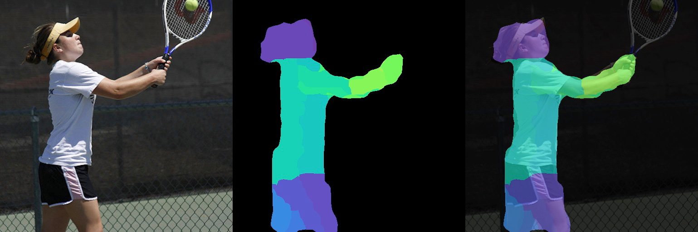
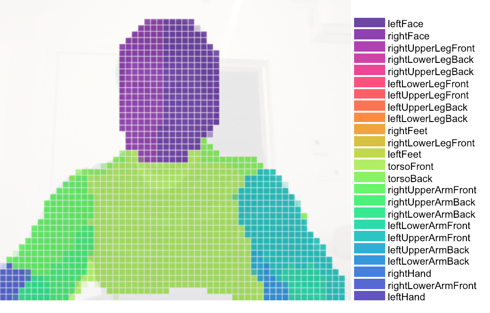
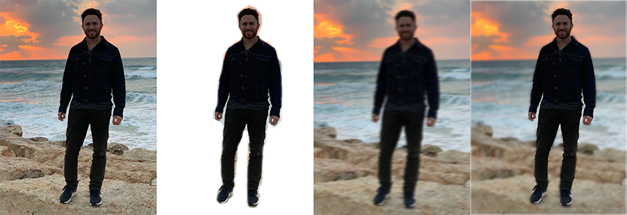

# BodyPix - Person Segmentation in the Browser

This package contains a standalone model called BodyPix, as well as some demos, for running real-time person and body part segmentation in the browser using TensorFlow.js.

[Try the demo here!](https://storage.googleapis.com/tfjs-models/demos/body-pix/index.html)


This model can be used to segment an image into pixels that are and are not part of a person, and into
pixels that belong to each of twenty-four body parts.  It works for a single person, and its ideal use case is for when there is only one person centered in an input image or video.  It can be combined with a person
detector to segment multiple people in an image by first cropping boxes for each detected person then estimating segmentation in each of those crops, but that responsibility is currently outside of the scope of this model.

To keep track of issues we use the [tensorflow/tfjs](https://github.com/tensorflow/tfjs) Github repo.

## Installation

You can use this as standalone es5 bundle like this:

```html
  <script src="https://cdn.jsdelivr.net/npm/@tensorflow/tfjs@1.0.0"></script>
  <script src="https://cdn.jsdelivr.net/npm/@tensorflow-models/body-pix@1.0.0"></script>
```

Or you can install it via npm for use in a TypeScript / ES6 project.

```sh
npm install @tensorflow-models/body-pix
```

## Usage

Either a person or part of the body can be segmented in an image.
Each methodology has similar input parameters with different outputs.

### Loading a pre-trained BodyPix Model

In the first step of segmentation, an image is fed through a pre-trained model.  BodyPix **comes with a few different versions of the model,** each corresponding to a MobileNet v1 architecture with a specific multiplier. To get started, a model must be loaded from a checkpoint, with the MobileNet architecture specified by the multiplier:

```javascript
const net = await bodyPix.load(multiplier);
```

#### Inputs

* **multiplier** - An optional number with values: `1.0`, `0.75`, or `0.50`, `0.25`. Defaults to `0.75`.   It is the float multiplier for the depth (number of channels) for all convolution operations. The value corresponds to a MobileNet architecture and checkpoint.  The larger the value, the larger the size of the layers, and more accurate the model at the cost of speed.  Set this to a smaller value to increase speed at the cost of accuracy.

**By default,** BodyPix loads a model with a **`0.75`** multiplier.  This is recommended for computers with **mid-range/lower-end GPUS.**  A model with a **`1.00`** muliplier is recommended for computers with **powerful GPUS.** A model with a **`0.50`** or **`0.25`** architecture is recommended for **mobile.**

### Person segmentation

Person segmentation segments an image into pixels that are and aren't part of a person.
It returns a binary array with 1 for the pixels that are part of the person, and 0 otherwise. The array size corresponds to the number of pixels in the image.


```javascript
const net = await bodyPix.load();

const segmentation = await net.estimatePersonSegmentation(image, outputStride, segmentationThreshold);
```

#### Inputs

* **image** - ImageData|HTMLImageElement|HTMLCanvasElement|HTMLVideoElement
  The input image to feed through the network.
* **outputStride** - the desired stride for the outputs when feeding the image through the model.  Must be 32, 16, 8.  Defaults to 16.  The higher the number, the faster the performance but slower the accuracy, and visa versa.
* **segmentationThreshold** - Must be between 0 and 1. For each pixel, the model estimates a score between 0 and 1 that indicates how confident it is that part of a person is displayed in that pixel.  This *segmentationThreshold* is used to convert these values
to binary 0 or 1s by determining the minimum value a pixel's score must have to be considered part of a person.  In essence, a higher value will create a tighter crop
around a person but may result in some pixels being that are part of a person being excluded from the returned segmentation mask.

#### Returns

An object containing a width, height, and a binary array with 1 for the pixels that are part of the person, and 0 otherwise. The array size corresponds to the number of pixels in the image.  The width and height correspond to the dimensions of the image the binary array is shaped to, which are the same dimensions of the input image.

#### Example Usage

##### via Script Tag

```html
<html>
  <head>
    <!-- Load TensorFlow.js -->
    <script src="https://cdn.jsdelivr.net/npm/@tensorflow/tfjs@1.0.0"></script>
    <!-- Load BodyPix -->
    <script src="https://cdn.jsdelivr.net/npm/@tensorflow-models/body-pix@1.0.0"></script>
 </head>

  <body>
    
  </body>
  <!-- Place your code in the script tag below. You can also use an external .js file -->
  <script>
    var outputStride = 16;
    var segmentationThreshold = 0.5;

    var imageElement = document.getElementById('image');

    bodyPix.load().then(function(net){
      return net.estimatePersonSegmentation(imageElement, outputStride, segmentationThreshold)
    }).then(function(segmentation){
      console.log(segmentation);
    })
  </script>
</html>
```

###### via NPM

```javascript
import * as bodyPix from '@tensorflow-models/body-pix';

const outputStride = 16;
const segmentationThreshold = 0.5;

const imageElement = document.getElementById('image');

// load the BodyPix model from a checkpoint
const net = await bodyPix.load();

const segmentation = await net.estimatePersonSegmentation(imageElement, outputStride, segmentationThreshold);

console.log(segmentation);

```

which would produce the output:

```javascript
{
  width: 640,
  height: 480,
  data: Uint8Array(307200) [0, 0, 0, 0, 0, 0, 0, 0, 0, 0, 0, 0, 0, 1, 1, 1, 0, 0, 0, 0, 0, 0, 0, 0, 0, 0, 0, 0, 0, 0, 0, 1, 1, 1, 1, 0, 0, 0, 0, 0, 0, 0, 0, 0, 0, 0, 0, 0, 0, 0, 0, 0, 0, 0, 0, 0, 0, 0, 0, 0, 0, 0, 1, 1, 1, 1, 1, 1, 1, 1, 0, 0, 0, 0, 0, 0, 0, 0, 0, 0, 0, 0, 0, 0, 0, 0, 0, 0, 0, 0, 0, 0, 0, 0, 0, 1, 1, 1, 0, …]
}
// the array contains 307200 values, one for each pixel of the 640x480 image that was passed to the function.
```

### Body Part Segmentation

Body part segmentation segments an image into pixels that are part of one of twenty-four body parts of a person, and to those that are not part of a person.
It returns an object containing an array with a part id from 0-24 for the pixels that are part of a corresponding body part, and -1 otherwise. The array size corresponds to the number of pixels in the image.


```javascript
const net = await bodyPix.load();

const partSegmentation = await net.estimatePartSegmentation(image, outputStride, segmentationThreshold);
```

#### The Body Parts

As stated above, the result contains an array with ids for one of 24 body parts, or -1 if there is no body part:

| Part Id | Part Name          |
|---------|--------------------|
| -1      | (no body part)     |
| 0       | leftFace           |
| 1       | rightFace          |
| 2       | rightUpperLegFront |
| 3       | rightLowerLegBack  |
| 4       | rightUpperLegBack  |
| 5       | leftLowerLegFront  |
| 6       | leftUpperLegFront  |
| 7       | leftUpperLegBack   |
| 8       | leftLowerLegBack   |
| 9       | rightFeet          |
| 10      | rightLowerLegFront |
| 11      | leftFeet           |
| 12      | torsoFront         |
| 13      | torsoBack          |
| 14      | rightUpperArmFront |
| 15      | rightUpperArmBack  |
| 16      | rightLowerArmBack  |
| 17      | leftLowerArmFront  |
| 18      | leftUpperArmFront  |
| 19      | leftUpperArmBack   |
| 20      | leftLowerArmBack   |
| 21      | rightHand          |
| 22      | rightLowerArmFront |
| 23      | leftHand           |

#### Inputs

* **image** - ImageData|HTMLImageElement|HTMLCanvasElement|HTMLVideoElement
  The input image to feed through the network.
* **outputStride** - the desired stride for the outputs when feeding the image through the model.  Must be 32, 16, 8.  Defaults to 16.  The higher the number, the faster the performance but slower the accuracy, and visa versa.
* **segmentationTreshold** - Must be between 0 and 1. For each pixel, the model estimates a score between 0 and 1 that indicates how confident it is that part of a person is displayed in that pixel.  In part segmentation, this *segmentationThreshold* is used to convert these values
to binary 0 or 1s by determining the minimum value a pixel's score must have to be considered part of a person, and clips the estimated part ids for each pixel by setting their values to -1 if the corresponding mask pixel value had a value of 0. In essence, a higher value will create a tighter crop
around a person but may result in some pixels being that are part of a person being excluded from the returned part segmentation.

#### Returns

An object containing a width, height, and an array with a part id from 0-24 for the pixels that are part of a corresponding body part, and -1 otherwise. The array size corresponds to the number of pixels in the image. The width and height correspond to the dimensions of the image the array is shaped to, which are the same dimensions of the input image.

#### Example Usage

##### via Script Tag

```html
<html>
  <head>
    <!-- Load TensorFlow.js -->
    <script src="https://cdn.jsdelivr.net/npm/@tensorflow/tfjs@1.0.0"></script>
    <!-- Load BodyPix -->
    <script src="https://cdn.jsdelivr.net/npm/@tensorflow-models/body-pix@1.0.0"></script>
 </head>

  <body>
    
  </body>
  <!-- Place your code in the script tag below. You can also use an external .js file -->
  <script>
    var outputStride = 16;
    var segmentationThreshold = 0.5;

    var imageElement = document.getElementById('image');

    bodyPix.load().then(function(net){
      return net.estimatePartSegmentation(imageElement, outputStride, segmentationThreshold)
    }).then(function(partSegmentation){
      console.log(partSegmentation);
    })
  </script>
</html>
```

###### via NPM

```javascript
import * as bodyPix from '@tensorflow-models/body-pix';

const outputStride = 16;
const segmentationThreshold = 0.5;

const imageElement = document.getElementById('image');

// load the person segmentation model from a checkpoint
const net = await bodyPix.load();

const segmentation = await net.estimatePartSegmentation(imageElement, outputStride, segmentationThreshold);

console.log(segmentation);

```

which would produce the output:

```javascript
{
  width: 680,
  height: 480,
  data: Int32Array(307200) [-1, -1, -1, -1, -1, -1, -1, -1, -1, -1, -1, -1, -1, -1, -1, -1, -1, -1, -1, -1, 3, 3, 3, 3, -1, -1, -1, -1, -1, -1, -1, -1, -1, -1, -1, -1, -1, -1, -1, 0, 0, 0, 0, 0, 1, 1, 2, -1, -1, -1, -1, -1, -1, -1, -1, -1, -1, -1, -1, -1, -1, -1, -1, -1, -1, 15, 15, 15, 15, 16, 16, -1, -1, -1, -1, -1, -1, -1, -1, -1, -1, -1, -1, -1, -1, -1, -1, -1, -1, 23, 23, 23, 22, 22, -1, -1, -1, -1,  …]
}
// the array contains 307200 values, one for each pixel of the 640x480 image that was passed to the function.
```

### Output Utility Functions

BodyPix contains utility functions to help with drawing and compositing using the outputs. **These API methods are experimental and subject to change.**

#### `toMaskImageData`

Given the output from estimating person segmentation, generates a black image with opacity and transparency at each pixel determined by the corresponding binary segmentation value at the pixel from the output.  In other words, pixels where there is a person will be transparent and where there is not a person will be opaque, and visa-versa when `maskBackground` is set to false. This can be used as a mask to crop a person or the background when compositing.

##### Inputs

* **segmentation** The output from estimagePersonSegmentation.
* **maskBackground** If the mask should be opaque where the background is. Defaults to true. When set to true, pixels where there is a person are transparent and where there is a background become opaque, and visa-versa when set to false.

##### Returns

An [ImageData](https://developer.mozilla.org/en-US/docs/Web/API/ImageData) with the same width and height of the personSegmentation, with opacity and transparency at each pixel determined by the corresponding binary segmentation value at the pixel from the output.

##### Example Usage

```javascript
const imageElement = documet.getElementById('person');

const net = await bodyPix.load();
const personSegmentation = await net.estimatePersonSegmentation(imageElement);

// by setting maskBackground to false, the maskImage that is generated will be opaque where there is a person and transparent where there is a background.
const maskBackground = false;
const maskImage = bodyPix.toMaskImageData(personSegmentation, maskBackground);
```


*With the output from `estimatePersonSegmentation` on the first image above, `toMaskImageData` will produce an [ImageData](https://developer.mozilla.org/en-US/docs/Web/API/ImageData) that either looks like the second image above if `maskBackground` is set to true (by default), or the third image if `maskBackground` is set to false.  This can be used to mask either the person or the background using the method `drawMask`.*

#### `toColoredPartImageData`

Given the output from estimating part segmentation, and an array of colors indexed by part id, generates an image with the corresponding color for each part at each pixel, and white pixels where there is no part.

##### Inputs

* **partSegmentation** The output from estimatePartSegmentation.

* **partColors** A multi-dimensional array of rgb colors indexed by part id.  Must have 24 colors, one for every part.  For some sample `partColors` check out [the ones used in the demo.](./demos/part_color_scales.js)

##### Returns

An [ImageData](https://developer.mozilla.org/en-US/docs/Web/API/ImageData) with the same width and height of the partSegmentation, with the corresponding color for each part at each pixel, and black pixels where there is no part.

##### Example usage

```javascript
const imageElement = document.getElementById('person');

const net = await bodyPix.load();
const partSegmentation = await net.estimatePartSegmentation(imageElement);

const warm = [
  [110, 64, 170], [106, 72, 183], [100, 81, 196], [92, 91, 206],
  [84, 101, 214], [75, 113, 221], [66, 125, 224], [56, 138, 226],
  [48, 150, 224], [40, 163, 220], [33, 176, 214], [29, 188, 205],
  [26, 199, 194], [26, 210, 182], [28, 219, 169], [33, 227, 155],
  [41, 234, 141], [51, 240, 128], [64, 243, 116], [79, 246, 105],
  [96, 247, 97],  [115, 246, 91], [134, 245, 88], [155, 243, 88]
];


const invert = true;

// the colored part image is an rgb image with a corresponding color from thee rainbow colors for each part at each pixel, and black pixels where there is no part.
const coloredPartImage = bodyPix.toColoredPartImageData(partSegmentation, rainbow);
const opacity = 0.7;
const flipHorizontal = true;
const maskBlurAmount = 0;
const canvas = document.getElementById('canvas');
// draw the colored part image on top of the original image onto a canvas.  The colored part image will be drawn semi-transparent, with an opacity of 0.7, allowing for the original image to be visible under.
bodyPix.drawMask(
    canvas, imageElement, coloredPartImageData, opacity, maskBlurAmount,
    flipHorizontal);
```



*With the output from `estimatePartSegmentation` on the first image above, and a 'warm' color scale, `toColoredPartImageData` will produce an `ImageData` that looks like the second image above.  The colored part image can be drawn on top of the original image with an `opacity` of 0.7 onto a canvas using `drawMask`; the result is shown in the third image above.*

#### `drawMask`

Draws an image onto a canvas and draws an `ImageData` containing a mask on top of it with a specified opacity; The `ImageData` is typically generated using `toMaskImageData` or `toColoredPartImageData`.

##### Inputs

* **canvas** The canvas to be drawn onto.
* **image** The original image to apply the mask to.
* **maskImage** An ImageData containing the mask.  Ideally this should be generated by `toMaskImageData` or `toColoredPartImageData.`
* **maskOpacity** The opacity when drawing the mask on top of the image. Defaults to 0.7. Should be a float between 0 and 1.
* **maskBlurAmount** How many pixels to blur the mask by. Defaults to 0. Should be an integer between 0 and 20.
* **flipHorizontal** If the result should be flipped horizontally.  Defaults to false.

##### Example usage

```javascript
const imageElement = document.getElementById('image');

const net = await bodyPix.load();
const segmentation = await net.estimatePersonSegmentation(imageElement);

const maskBackground = true;
// Convert the personSegmentation into a mask to darken the background.
// Since maskBackground is set to true, there will be 1s where the background is and 0s where the person is.
const backgroundDarkeningMask = bodyPix.toMaskImageData(personSegmentation, maskBackground);

const opacity = 0.7;
const maskBlurAmount = 3;
const flipHorizontal = true;

const canvas = document.getElementById('canvas');
// draw the mask onto the image on a canvas.  With opacity set to 0.7 and maskBlurAmount set to 3, this will darken the background and blur the darkened background's edge.
bodyPix.drawMask(
    canvas, imageElement, backgroundDarkeningMask, opacity, maskBlurAmount, flipHorizontal);
```


*The above shows drawing a mask generated by `toMaskImageData` on top of an image and canvas using `toMask`.  In this case, `segmentationThreshold` was set to a lower value of 0.25, making the mask include more pixels.  The top two images show the mask drawn on top of the image, and the second two images show the mask blurred by setting  `maskBlurAmount` to 9 before being drawn onto the image, resulting in a smoother transition between the person and the masked background.*

#### `drawPixelatedMask`

Draws an image onto a canvas and draws an `ImageData` containing a mask on top of it with a specified opacity; The `ImageData` is typically generated using `toColoredPartImageData`. Different from `drawMask`, this rendering function applies the pixelation effect to the BodyPix's body part segmentation prediction. This allows a user to display low resolution body part segmentation and thus offers an aesthetic interpretation of the body part segmentation prediction.

##### Inputs

* **canvas** The canvas to be drawn onto.
* **image** The original image to apply the mask to.
* **maskImage** An ImageData containing the mask.  Ideally this should be generated by `toColoredPartImageData.`
* **maskOpacity** The opacity when drawing the mask on top of the image. Defaults to 0.7. Should be a float between 0 and 1.
* **maskBlurAmount** How many pixels to blur the mask by. Defaults to 0. Should be an integer between 0 and 20.
* **flipHorizontal** If the result should be flipped horizontally.  Defaults to false.
* **pixelCellWidth** The width of each pixel cell. Default to 10 px.

##### Example usage

```javascript
const imageElement = document.getElementById('person');

const net = await bodyPix.load();
const partSegmentation = await net.estimatePartSegmentation(imageElement);

const rainbow = [
  [110, 64, 170], [143, 61, 178], [178, 60, 178], [210, 62, 167],
  [238, 67, 149], [255, 78, 125], [255, 94, 99],  [255, 115, 75],
  [255, 140, 56], [239, 167, 47], [217, 194, 49], [194, 219, 64],
  [175, 240, 91], [135, 245, 87], [96, 247, 96],  [64, 243, 115],
  [40, 234, 141], [28, 219, 169], [26, 199, 194], [33, 176, 213],
  [47, 150, 224], [65, 125, 224], [84, 101, 214], [99, 81, 195]
];

// the colored part image is an rgb image with a corresponding color from thee rainbow colors for each part at each pixel, and white pixels where there is no part.
const coloredPartImage = bodyPix.toColoredPartImageData(partSegmentation, rainbow);
const opacity = 0.7;
const flipHorizontal = true;
const maskBlurAmount = 0;
const pixelCellWidth = 10.0;
const canvas = document.getElementById('canvas');
// draw the pixelated colored part image on top of the original image onto a canvas.  Each pixel cell's width will be set to 10 px. The pixelated colored part image will be drawn semi-transparent, with an opacity of 0.7, allowing for the original image to be visible under.
bodyPix.drawPixelatedMask(
    canvas, imageElement, coloredPartImageData, opacity, maskBlurAmount,
    flipHorizontal, pixelCellWidth);
```



*The pixelation effect is applied to part image using `drawPixelatedMask`; the result is shown in the image above.*

#### `drawBokehEffect`

Given a personSegmentation and an image, draws the image with its background
blurred onto a canvas.

An example of applying a [bokeh effect](https://www.nikonusa.com/en/learn-and-explore/a/tips-and-techniques/bokeh-for-beginners.html) can be seen in this [demo](https://storage.googleapis.com/tfjs-models/demos/body-pix/index.html):


##### Inputs

* **canvas** The canvas to draw the background-blurred image onto.
* **image** The image to blur the background of and draw.
* **personSegmentation** A personSegmentation object, containing a binary array with 1 for the pixels that are part of the person, and 0 otherwise. Must have the same dimensions as the image.
* **backgroundBlurAmount** How many pixels in the background blend into each
other.  Defaults to 3. Should be an integer between 1 and 20.
* **edgeBlurAmount** How many pixels to blur on the edge between the person
and the background by.  Defaults to 3. Should be an integer between 0 and 20.
* **flipHorizontal** If the output should be flipped horizontally. Defaults to false.

##### Example Usage

```javascript
const imageElement = document.getElementById('image');

const net = await bodyPix.load();
const personSegmentation = await net.estimatePersonSegmentation(imageElement);

const backgroundBlurAmount = 3;
const edgeBlurAmount = 3;
const flipHorizontal = true;

const canvas = document.getElementById('canvas');
// draw the image with the background blurred onto the canvas. The edge between the person and blurred background is blurred by 3 pixels.
bodyPix.drawBokehEffect(
  canvas, imageElement, personSegmentation, backgroundBlurAmount, edgeBlurAmount, flipHorizontal);
```



*The above shows the process of applying a 'bokeh' effect to an image (the left-most one) with `drawBokehEffect`.  An **inverted** mask is generated from a `personSegmentation`.  The original image is then drawn onto the canvas, and using the [canvas compositing](https://developer.mozilla.org/en-US/docs/Web/API/CanvasRenderingContext2D/globalCompositeOperation) operation `destination-over` the mask is drawn onto the canvas, causing the background to be removed.  The original image is blurred and drawn onto the canvas where it doesn't overlap with the existing image using the compositing operation `destination-over`.  The result is seen in the right-most image.*

## Developing the Demos

Details for how to run the demos are included in the `demos/` folder.
