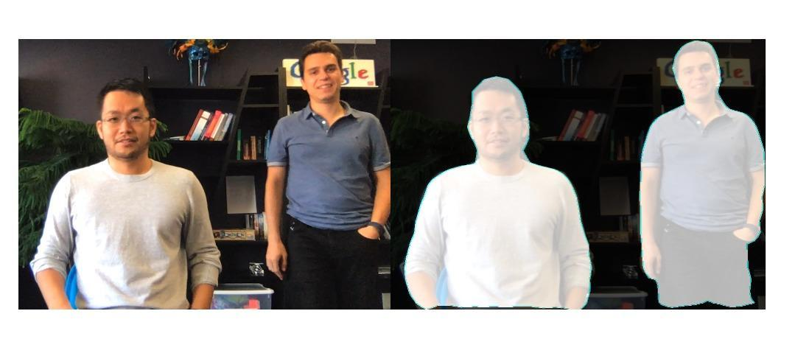
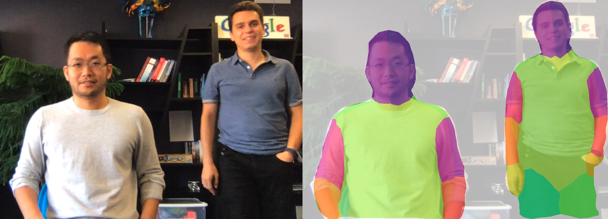
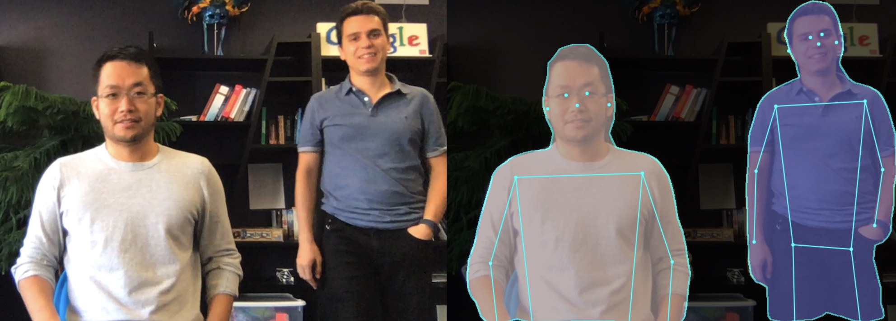
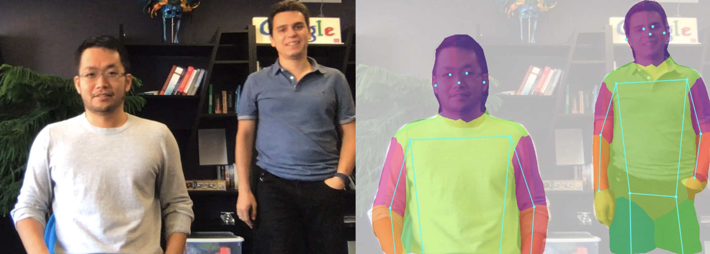
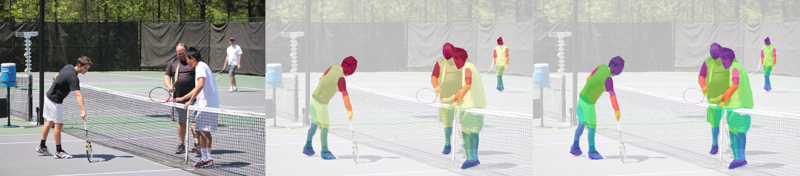

# BodyPix - Person Segmentation in the Browser

## Note: We've just released Version 2.0 with **multi-person** support, a **new ResNet** model and API. Check out the new documentation below. For README of the previous 1.0 version, please look at the [README published on NPM](https://www.npmjs.com/package/@tensorflow-models/body-pix/v/1.1.2).

This package contains a standalone model called BodyPix, as well as some demos, for running real-time person and body part segmentation in the browser using TensorFlow.js.

## [Try the live demo here!](https://storage.googleapis.com/tfjs-models/demos/body-pix/index.html)

[](https://storage.googleapis.com/tfjs-models/demos/body-pix/index.html)

This model can be used to segment an image into pixels that are and are not part of a person, and into
pixels that belong to each of twenty-four body parts.  It works for multiple people in an input image or video.

To keep track of issues we use the [tensorflow/tfjs](https://github.com/tensorflow/tfjs) Github repo.

## Contributors
### Main Contributors
* Tyler (Lixuan) Zhu, Twitter: [tylerzhu3](https://twitter.com/TYLERZHU3)
* Dan Oved, Twitter: [oveddan](https://twitter.com/oveddan)
### Acknowledgement
* Daniel Smilkov, Twitter: [dsmilkov](https://twitter.com/dsmilkov)
* Ann Yuan, Twitter: [greenbeandou](https://twitter.com/greenbeandou)
* Per Karlsson, Twitter: [karlssonper](https://twitter.com/karlssonper)
* Irene Alvarado, Twitter: [ire_alva](https://twitter.com/ire_alva)
* Nikhil Thorat, Twitter: [nsthorat](https://twitter.com/nsthorat)
### Special thanks for participants in the demo video
* Fabian Pedregosa, Twitter: [fpedregosa](https://twitter.com/fpedregosa)
* Ross Goroshin, Scholar: [ross_goroshin](https://scholar.google.com/citations?user=EC4o-1oAAAAJ&hl=en)

## Usage

You can use this with script tags as follows:

```html
<html>
  <head>
    <!-- Load TensorFlow.js -->
    <script src="https://cdn.jsdelivr.net/npm/@tensorflow/tfjs@1.2"></script>
    <!-- Load BodyPix -->
    <script src="https://cdn.jsdelivr.net/npm/@tensorflow-models/body-pix@2.0"></script>
 </head>

  <body>
    
  </body>
  <!-- Place your code in the script tag below. You can also use an external .js file -->
  <script>
    const img = document.getElementById('image');

    async function loadAndPredict() {
      const net = await bodyPix.load(/** optional arguments, see below **/);

      /**
       * One of (see documentation below):
       *   - net.segmentPerson
       *   - net.segmentPersonParts
       *   - net.segmentMultiPerson
       *   - net.segmentMultiPersonParts
       * See documentation below for details on each method.
       */
      const segmentation = await net.segmentPerson(img);
      console.log(segmentation);
    }
    loadAndPredict();
  </script>
</html>
```

Or you can install it via npm for use in a TypeScript / ES6 project.

```sh
$ npm install @tensorflow-models/body-pix
```

```js
const bodyPix = require('@tensorflow-models/body-pix');

const img = document.getElementById('image');

async function loadAndPredict() {
  const net = await bodyPix.load(/** optional arguments, see below **/);

  /**
   * One of (see documentation below):
   *   - net.segmentPerson
   *   - net.segmentPersonParts
   *   - net.segmentMultiPerson
   *   - net.segmentMultiPersonParts
   * See documentation below for details on each method.
    */
  const segmentation = await net.segmentPerson(img);
  console.log(segmentation);
}
loadAndPredict();
```

## Loading the model

BodyPix **comes with a few different versions of the model,** with different performance characteristics trading off model size and prediction time with accuracy.

To get started, a model must be loaded:

```javascript
const net = await bodyPix.load();
```

**By default**, BodyPix loads a MobileNetV1 architecture with a **`0.75`** multiplier.  This is recommended for computers with mid-range/lower-end GPUs.  A model with a **`0.50`** multiplier is recommended for mobile. The ResNet architecture is recommended for computers with even more powerful GPUs.

If you want to load other versions of the model, specify the architecture explicitly in `bodyPix.load()` using a `ModelConfig` dictionary:

#### ResNet (larger, slower, more accurate) \*\*new!\*\*
```javascript
const net = await bodyPix.load({
  architecture: 'ResNet50',
  outputStride: 32,
  quantBytes: 2
});
```

#### MobileNet (smaller, faster, less accurate)
```javascript
const net = await bodyPix.load({
  architecture: 'MobileNetV1',
  outputStride: 16,
  multiplier: 0.75,
  quantBytes: 2
});
```

#### Config params in bodyPix.load()

 * **architecture** - Can be either `MobileNetV1` or `ResNet50`. It determines which BodyPix architecture to load.

 * **outputStride** - Can be one of `8`, `16`, `32` (Stride `16`, `32` are supported for the ResNet architecture and stride `8`, and `16` are supported for the MobileNetV1 architecture). It specifies the output stride of the BodyPix model. The smaller the value, the larger the output resolution, and more accurate the model at the cost of speed.  ***A larger value results in a smaller model and faster prediction time but lower accuracy***.

 * **multiplier** - Can be one of `1.0`, `0.75`, or `0.50` (The value is used *only* by the MobileNetV1 architecture and not by the ResNet architecture). It is the float multiplier for the depth (number of channels) for all convolution ops. The larger the value, the larger the size of the layers, and more accurate the model at the cost of speed. ***A smaller value results in a smaller model and faster prediction time but lower accuracy***.

 * **quantBytes** - This argument controls the bytes used for weight quantization. The available options are:

   - `4`. 4 bytes per float (no quantization). Leads to highest accuracy and original model size.
   - `2`. 2 bytes per float. Leads to slightly lower accuracy and 2x model size reduction.
   - `1`. 1 byte per float. Leads to lower accuracy and 4x model size reduction.

   The following table contains the corresponding BodyPix 2.0 model checkpoint sizes (widthout gzip) when using different quantization bytes:

     | Architecture       | quantBytes=4 | quantBytes=2 | quantBytes=1 |
     | ------------------ |:------------:|:------------:|:------------:|
     | ResNet50           | ~90MB        | ~45MB        | ~22MB        |
     | MobileNetV1 (1.00) | ~13MB        | ~6MB         | ~3MB         |
     | MobileNetV1 (0.75) | ~5MB         | ~2MB         | ~1MB         |
     | MobileNetV1 (0.50) | ~2MB         | ~1MB         | ~0.6MB       |


* **modelUrl** - An optional string that specifies custom url of the model. This is useful for local development or countries that don't have access to the models hosted on GCP.

## Making a prediction

### Person segmentation

Given an image with one or more people, person segmentation predicts segmentation for *all* people together. It returns a `PersonSegmentation` object corresponding to segmentation for people in the image. It does not disambiguate between different individuals. If you need to segment individuals separately use `segmentMultiPerson` (the caveat is this method is slower).



```javascript
const segmentation = await net.segmentPerson(image, {
  flipHorizontal: false,
  internalResolution: 'medium',
  segmentationThreshold: 0.7
});
```

#### Params in segmentPerson()

* **image** - ImageData|HTMLImageElement|HTMLCanvasElement|HTMLVideoElement
   The input image to feed through the network.
* **config** - an optional dictionary containing:
  * **flipHorizontal** - Defaults to false.  If the segmentation & pose should be flipped/mirrored horizontally.  This should be set to true for videos where the video is by default flipped horizontally (i.e. a webcam), and you want the segmentation & pose to be returned in the proper orientation.
  * **internalResolution** - Defaults to `medium`. The internal resolution percentage that the input is resized to before inference. The larger the `internalResolution` the more accurate the model at the cost of slower prediction times. Available values are `low`, `medium`, `high`, `full`, or a percentage value between 0 and 1. The values `low`, `medium`, `high`, and
`full` map to 0.25, 0.5, 0.75, and 1.0 correspondingly.
  * **segmentationThreshold** - Defaults to 0.7. Must be between 0 and 1. For each pixel, the model estimates a score between 0 and 1 that indicates how confident it is that part of a person is displayed in that pixel.  This *segmentationThreshold* is used to convert these values
to binary 0 or 1s by determining the minimum value a pixel's score must have to be considered part of a person.  In essence, a higher value will create a tighter crop
around a person but may result in some pixels being that are part of a person being excluded from the returned segmentation mask.
  * **maxDetections** -  Defaults to 10. For pose estimation, the maximum number of person poses to detect per image.
  * **scoreThreshold** - Defaults to 0.3. For pose estimation, only return individual person detections that have root part score greater or equal to this value.
  * **nmsRadius** - Defaults to 20. For pose estimation, the non-maximum suppression part distance in pixels. It needs to be strictly positive. Two parts suppress each other if they are less than `nmsRadius` pixels away.

#### Returns

It returns a `Promise` that resolves with a `SemanticPersonSegmentation` object. Multiple people in the image get merged into a single binary mask. In addition to `width`, `height`, and `data` fields, it returns a field `allPoses` which contains poses for all people.


```javascript
// the data array for the all people containing 307200 values, one for each pixel of the 640x480 image.
{
  width: 640,
  height: 480,
  data: Uint8Array(307200) [0, 0, 0, 0, 0, 0, 0, 0, 0, 0, 0, 0, 0, 1, 0, 0, 1, …],
  allPoses: [{"score": 0.4, "keypoints": […]}, …]
}
```

### Person body part segmentation
Given an image with one or more people, BodyPix's `segmentPersonParts` method predicts the 24 body part segmentations for all people. It returns a `PartSegmentation` object corresponding to body parts for each pixel for all people merged.   If you need to segment individuals separately use `segmentMultiPersonParts` (the caveat is this method is slower).



#### The Body Parts

The `PartSegmentation` object contains a width, height, `Pose` and an Int32Array with a part id from 0-24 for the pixels that are part of a corresponding body part, and -1 otherwise.

| Part Id | Part Name              | Part Id | Part Name              |
|---------|------------------------|---------|------------------------|
| 0       | left_face              | 12      | torso_front            |
| 1       | right_face             | 13      | torso_back             |
| 2       | left_upper_arm_front   | 14      | left_upper_leg_front   |
| 3       | left_upper_arm_back    | 15      | left_upper_leg_back
| 4       | right_upper_arm_front  | 16      | right_upper_leg_front
| 5       | right_upper_arm_back   | 17      | right_upper_leg_back
| 6       | left_lower_arm_front   | 18      | left_lower_leg_front
| 7       | left_lower_arm_back    |  19      | left_lower_leg_back
| 8       | right_lower_arm_front  | 20      | right_lower_leg_front
| 9       | right_lower_arm_back   | 21      | right_lower_leg_back
| 10      | left_hand              | 22      | left_foot
| 11      | right_hand             | 23      | right_foot

*Note: Part Id value -1 represents the non-person background)*

```javascript
const segmentation = await net.segmentPersonParts(image, {
  flipHorizontal: false,
  internalResolution: 'medium',
  segmentationThreshold: 0.7
});
```

#### Params in segmentPersonParts

* **image** - ImageData|HTMLImageElement|HTMLCanvasElement|HTMLVideoElement
   The input image to feed through the network.
* **config** - an object containing:
  * **flipHorizontal** - Defaults to false.  If the segmentation & pose should be flipped/mirrored horizontally.  This should be set to true for videos where the video is by default flipped horizontally (i.e. a webcam), and you want the segmentation & pose to be returned in the proper orientation.
  * **internalResolution** - Defaults to 'medium'. The internal resolution used by the model. The larger the internal resolution the more accurate the model at the cost of slower prediction times. Available values are 'low', 'medium', 'high' or a positive number.
  * **segmentationThreshold** - Must be between 0 and 1. For each pixel, the model estimates a score between 0 and 1 that indicates how confident it is that part of a person is displayed in that pixel.  This *segmentationThreshold* is used to convert these values
to binary 0 or 1s by determining the minimum value a pixel's score must have to be considered part of a person.  In essence, a higher value will create a tighter crop
around a person but may result in some pixels being that are part of a person being excluded from the returned segmentation mask.
  * **maxDetections** -  Defaults to 10. For pose estimation, the maximum number of person pose to detect per image.
  * **scoreThreshold** - Defaults to 0.4. For pose estimation, only return individual person detections that have root part score greater or equal to this value.
  * **nmsRadius** - Defaults to 20. For pose estimation, the non-maximum suppression part distance in pixels. It needs to be strictly positive. Two parts suppress each other if they are less than `nmsRadius` pixels away.

#### Returns

It returns a `Promise` that resolves with a `SemanticPartSegmentation` object. When there are multiple people in the image they are merged into a single array of part values. In addition to `width`, `height`, and `data` fields, it returns a field `allPoses` which contains poses for all people..

```javascript
// The array contains 307200 values, one for each pixel of the 640x480 image
// that was passed to the function.
{
  width: 680,
  height: 480,
  data: Int32Array(307200) [0, 0, 0, 0, 0, 0, 0, 0, 0, 0, 2, 2, 0, 1, 0, 0, …],
  allPoses: [{"score": 0.4, "keypoints": […]}, …]
}
```

### Multi-person segmentation

Given an image with multiple people, multi-person segmentation model predicts segmentation for *each* person individually. It returns *an array* of `PersonSegmentation` and each corresponding to one person. Each element is a binary array for one person with 1 for the pixels that are part of the person, and 0 otherwise. The array size corresponds to the number of pixels in the image.

If you don't need to segment individuals separately then use `segmentPerson` which is faster and does not segment individuals.



```javascript
const segmentation = await net.segmentMultiPerson(image, {
  flipHorizontal: false,
  internalResolution: 'medium',
  segmentationThreshold: 0.7,
  maxDetections: 10,
  scoreThreshold: 0.2,
  nmsRadius: 20,
  minKeypointScore: 0.3,
  refineSteps: 10
});
```

#### Params in segmentMultiPerson()

* **image** - ImageData|HTMLImageElement|HTMLCanvasElement|HTMLVideoElement
   The input image to feed through the network.
* **config** - an optional dictionary containing:
  * **flipHorizontal** - Defaults to false.  If the segmentation & pose should be flipped/mirrored  horizontally.  This should be set to true for videos where the video is by default flipped horizontally (i.e. a webcam), and you want the segmentation & pose to be returned in the proper orientation.
  * **internalResolution** - Defaults to 'medium'. The internal resolution used by the model. The larger the internal resolution the more accurate the model at the cost of slower prediction times. Available values are 'low', 'medium', 'high' or a positive number.
  * **segmentationThreshold** - Defaults to 0.7. Must be between 0 and 1. For each pixel, the model estimates a score between 0 and 1 that indicates how confident it is that part of a person is displayed in that pixel.  This *segmentationThreshold* is used to convert these values
to binary 0 or 1s by determining the minimum value a pixel's score must have to be considered part of a person.  In essence, a higher value will create a tighter crop
around a person but may result in some pixels being that are part of a person being excluded from the returned segmentation mask.
  * **maxDetections** -  Defaults to 10. Maximum number of returned individual person detections per image.
  * **scoreThreshold** - Defaults to 0.4. Only return individual person detections that have root part score greater or equal to this value.
  * **nmsRadius** - Defaults to 20. Non-maximum suppression part distance in pixels. It needs to be strictly positive. Two parts suppress each other if they are less than `nmsRadius` pixels away.
  * **minKeypointScore** - Default to 0.3. Keypoints above the score are used for matching and assigning segmentation mask to each person..
  * **refineSteps** - Default to 10. The number of refinement steps used when assigning the individual person segmentations. It needs to be strictly positive. The larger the higher the accuracy and slower the inference.

#### Returns

It returns a `Promise` that resolves with **an array** of `PersonSegmentation`s. When there are multiple people in the image, each `PersonSegmentation` object in the array represents one person. More details about the `PersonSegmentation` object can be found in the documentation of the `segmentPerson` method. In addition to `width`, `height`, and `data` fields, `PersonSegmentation` object also has a field `pose`. It contains each person's pose same as PoseNet, but less accurate.


```javascript
[{
  width: 640,
  height: 480,
  data: Uint8Array(307200) [0, 0, 0, 0, 0, 0, 0, 0, 0, 0, 0, 0, 0, 1, 1, 1, 1 …],
  pose: {"score": 0.4, "keypoints": […]}
 },
 ...
 // the data array for the 1st person containing 307200 values, one for each pixel of the 640x480 image.
 {
  width: 640,
  height: 480,
  data: Uint8Array(307200) [0, 0, 0, 0, 0, 0, 0, 0, 0, 0, 0, 0, 0, 1, 0, 0, 1, …],
  pose: {"score": 0.4, "keypoints": […]}
 }]
 // the data array for the n-th person containing 307200 values, one for each pixel of the 640x480 image.
```


### Multi-person body part segmentation

Given an image with multiple people. BodyPix's `segmentMultiPersonParts` method predicts the 24 body part segmentations for *each* person. It returns *an array* of `PartSegmentation`s, each corresponding to one of the people. The `PartSegmentation` object contains a width, height, `Pose` and an Int32Array with a part id from 0-24 for the pixels that are part of a corresponding body part, and -1 otherwise.

See the table in the documentation of `segmentPersonParts` for the values for each part.



```javascript
const segmentation = await net.segmentMultiPersonParts(image, {
  flipHorizontal: false,
  internalResolution: 'medium',
  segmentationThreshold: 0.7,
  maxDetections: 10,
  scoreThreshold: 0.2,
  nmsRadius: 20,
  minKeypointScore: 0.3,
  refineSteps: 10
});
```

#### Params in segmentMultiPersonParts

* **image** - ImageData|HTMLImageElement|HTMLCanvasElement|HTMLVideoElement
   The input image to feed through the network.
* **config** - an object containing:
  * **flipHorizontal** - Defaults to false.  If the segmentation & pose should be flipped/mirrored  horizontally.  This should be set to true for videos where the video is by default flipped horizontally (i.e. a webcam), and you want the segmentation & pose to be returned in the proper orientation.
  * **internalResolution** - Defaults to 'medium'. The internal resolution used by the model. The larger the internal resolution the more accurate the model at the cost of slower prediction times. Available values are 'low', 'medium', 'high' or a positive number.
  * **segmentationThreshold** - Must be between 0 and 1. For each pixel, the model estimates a score between 0 and 1 that indicates how confident it is that part of a person is displayed in that pixel.  This *segmentationThreshold* is used to convert these values
to binary 0 or 1s by determining the minimum value a pixel's score must have to be considered part of a person.  In essence, a higher value will create a tighter crop
around a person but may result in some pixels being that are part of a person being excluded from the returned segmentation mask.
  * **maxDetections** - Defaults to 10. Maximum number of returned individual person detections per image.
  * **scoreThreshold** - Defaults to 0.4. Only return individual person detections that have root part score greater or equal to this value.
  * **nmsRadius** - Defaults to 20. Non-maximum suppression part distance in pixels. It needs to be strictly positive. Two parts suppress each other if they are less than `nmsRadius` pixels away.
  * **minKeypointScore** - Default to 0.3. Keypoints above the score are used for matching and assigning segmentation mask to each person.
  * **refineSteps** - Default to 10. The number of refinement steps used when assigning the individual person segmentations. It needs to be strictly positive. The larger the higher the accuracy and slower the inference.

#### Returns

It returns a `Promise` that resolves with **an array** of `PartSegmentation`s. When there are multiple people in the image, each `PartSegmentation` object in the array represents one person. More details about the `PartSegmentation` object can be found in the documentation of the `segmentPersonParts` method. In addition to `width`, `height`, and `data` fields, `PartSegmentation` object also has a field `pose`. It contains each person's pose same as PoseNet, but less accurate.


```javascript
[{
  width: 680,
  height: 480,
  data: Int32Array(307200) [-1, -1, -1, -1, -1, -1, 15, 15 …],
  pose: {"score": 0.4, "keypoints": […]}
},
{
  width: 680,
  height: 480,
  data: Int32Array(307200) [2, 2, -1, -1, -1, -1, -1, -1 …],
  pose: {"score": 0.4, "keypoints": […]}
}]
// The array contains 307200 values, one for each pixel of the 640x480 image
// that was passed to the function.
```

## Output Visualization Utility Functions

BodyPix contains utility functions to help with drawing and compositing using the outputs. **These API methods are experimental and subject to change.**

### bodyPix.toMask

Given the output of person segmentation (or multi-person segmentation), generates a visualization of each pixel determined by the corresponding binary segmentation value at the pixel from the output.  In other words, pixels where there is a person will be colored by the foreground color and where there is not a person will be colored by the background color. This can be used as a mask to crop a person or the background when compositing.

#### Inputs

* **personSegmentation** The output from [segmentPerson](#person-segmentation) or [segmentMultiPerson](#multi-person-segmentation). The former is a SemanticPersonSegmentation object and later is an *array* of PersonSegmentation object.
* **foreground** The foreground color (r,g,b,a) for visualizing pixels that
belong to people.

* **background** The background color (r,g,b,a) for visualizing pixels that
 don't belong to people.

* **drawContour** Whether to draw the contour around each person's segmentation mask.

#### Returns

An [ImageData](https://developer.mozilla.org/en-US/docs/Web/API/ImageData) with the same width and height of the personSegmentation, with color and opacity at each pixel determined by the corresponding binary segmentation value at the pixel from the output.


*With the output from `segmentMultiPerson` on the first image above, `toMask` will produce an [ImageData](https://developer.mozilla.org/en-US/docs/Web/API/ImageData) that either looks like the second image above if setting `foregroundColor` to {r: 0, g: 0, b: 0, a: 0} and `backgroundColor` to {r: 0, g: 0, b: 0, a: 255} (by default), or the third image if if setting `foregroundColor` to {r: 0, g: 0, b: 0, a: 255} and `backgroundColor` to {r: 0, g: 0, b: 0, a: 0}.  This can be used to mask either the person or the background using the method `drawMask`.*

#### Example usage

```javascript
const img = document.getElementById('image');

const net = await bodyPix.load();
const segmentation = await net.segmentPerson(img);

// The mask image is an binary mask image with a 1 where there is a person and
// a 0 where there is not.
const coloredPartImage = bodyPix.toMask(segmentation);
const opacity = 0.7;
const flipHorizontal = false;
const maskBlurAmount = 0;
const canvas = document.getElementById('canvas');
// Draw the mask image on top of the original image onto a canvas.
// The colored part image will be drawn semi-transparent, with an opacity of
// 0.7, allowing for the original image to be visible under.
bodyPix.drawMask(
    canvas, img, coloredPartImage, opacity, maskBlurAmount,
    flipHorizontal);
```

### bodyPix.toColoredPartMask

Given the output from person body part segmentation (or multi-person body part segmentation) and an array of colors indexed by part id, generates an image with the corresponding color for each part at each pixel, and white pixels where there is no part.

#### Inputs

* **personPartSegmentation** The output from [segmentPersonParts](#person-body-part-segmentation) or [segmentMultiPersonParts](#Multi-person-body-part-segmentation). The former is a SemanticPartSegmentation object and later is an *array* of PartSegmentation object.

* **partColors** Optional, defaults to rainbow. A multi-dimensional array of rgb colors indexed by part id.  Must have 24 colors, one for every part. For some sample `partColors` check out [the ones used in the demo.](./demos/part_color_scales.js)

#### Returns

An [ImageData](https://developer.mozilla.org/en-US/docs/Web/API/ImageData) with the same width and height of the estimated person part segmentation, with the corresponding color for each part at each pixel, and black pixels where there is no part.

#### Example usage

```javascript
const img = document.getElementById('image');

const net = await bodyPix.load();
const partSegmentation = await net.segmentMultiPersonParts(img);

// The colored part image is an rgb image with a corresponding color from the
// rainbow colors for each part at each pixel, and black pixels where there is
// no part.
const coloredPartImage = bodyPix.toColoredPartMask(partSegmentation);
const opacity = 0.7;
const flipHorizontal = false;
const maskBlurAmount = 0;
const canvas = document.getElementById('canvas');
// Draw the colored part image on top of the original image onto a canvas.
// The colored part image will be drawn semi-transparent, with an opacity of
// 0.7, allowing for the original image to be visible under.
bodyPix.drawMask(
    canvas, img, coloredPartImage, opacity, maskBlurAmount,
    flipHorizontal);
```



*With the output from `segmentMultiPersonParts` on the first image above, a 'spectral' or 'rainbow' color scale in `toColoredPartMask` will produce an `ImageData` that looks like the second image or the third image above.*

### bodyPix.drawMask

Draws an image onto a canvas and draws an `ImageData` containing a mask on top of it with a specified opacity; The `ImageData` is typically generated using `toMask` or `toColoredPartMask`.

#### Inputs

* **canvas** The canvas to be drawn onto.
* **image** The original image to apply the mask to.
* **maskImage** An ImageData containing the mask.  Ideally this should be generated by `toMask` or `toColoredPartMask.`
* **maskOpacity** The opacity when drawing the mask on top of the image. Defaults to 0.7. Should be a float between 0 and 1.
* **maskBlurAmount** How many pixels to blur the mask by. Defaults to 0. Should be an integer between 0 and 20.
* **flipHorizontal** If the result should be flipped horizontally.  Defaults to false.

#### Example usage

```javascript
const img = document.getElementById('image');

const net = await bodyPix.load();
const segmentation = await net.segmentPerson(img);

const maskBackground = true;
// Convert the segmentation into a mask to darken the background.
const foregroundColor = {r: 0, g: 0, b: 0, a: 0};
const backgroundColor = {r: 0, g: 0, b: 0, a: 255};
const backgroundDarkeningMask = bodyPix.toMask(
    segmentation, foregroundColor, backgroundColor);

const opacity = 0.7;
const maskBlurAmount = 3;
const flipHorizontal = false;
const canvas = document.getElementById('canvas');
// Draw the mask onto the image on a canvas.  With opacity set to 0.7 and
// maskBlurAmount set to 3, this will darken the background and blur the
// darkened background's edge.
bodyPix.drawMask(
    canvas, img, backgroundDarkeningMask, opacity, maskBlurAmount, flipHorizontal);
```


*The above shows drawing a mask generated by `toMask` on top of an image and canvas using `toMask`.  In this case, `segmentationThreshold` was set to a lower value of 0.25, making the mask include more pixels.  The top two images show the mask drawn on top of the image, and the second two images show the mask blurred by setting  `maskBlurAmount` to 9 before being drawn onto the image, resulting in a smoother transition between the person and the masked background.*

### bodyPix.drawPixelatedMask

Draws an image onto a canvas and draws an `ImageData` containing a mask on top of it with a specified opacity; The `ImageData` is typically generated using `toColoredPartMask`. Different from `drawMask`, this rendering function applies the pixelation effect to the BodyPix's body part segmentation prediction. This allows a user to display low resolution body part segmentation and thus offers an aesthetic interpretation of the body part segmentation prediction.

#### Inputs

* **canvas** The canvas to be drawn onto.
* **image** The original image to apply the mask to.
* **maskImage** An ImageData containing the mask.  Ideally this should be generated by `toColoredPartMask`.
* **maskOpacity** The opacity when drawing the mask on top of the image. Defaults to 0.7. Should be a float between 0 and 1.
* **maskBlurAmount** How many pixels to blur the mask by. Defaults to 0. Should be an integer between 0 and 20.
* **flipHorizontal** If the result should be flipped horizontally.  Defaults to false.
* **pixelCellWidth** The width of each pixel cell. Default to 10 px.

#### Example usage

```javascript
const img = document.getElementById('image');

const net = await bodyPix.load();
const partSegmentation = await net.segmentPersonParts(img);

// The colored part image is an rgb image with a corresponding color from the
// rainbow colors for each part at each pixel, and white pixels where there is
// no part.
const coloredPartImage = bodyPix.toColoredPartMask(partSegmentation);
const opacity = 0.7;
const flipHorizontal = false;
const maskBlurAmount = 0;
const pixelCellWidth = 10.0;
const canvas = document.getElementById('canvas');
// Draw the pixelated colored part image on top of the original image onto a
// canvas.  Each pixel cell's width will be set to 10 px. The pixelated colored
// part image will be drawn semi-transparent, with an opacity of 0.7, allowing
// for the original image to be visible under.
bodyPix.drawPixelatedMask(
    canvas, img, coloredPartImage, opacity, maskBlurAmount,
    flipHorizontal, pixelCellWidth);
```


*The pixelation effect is applied to part image using `drawPixelatedMask`; the result is shown in the image above.*

### bodyPix.drawBokehEffect

Given a personSegmentation and an image, draws the image with its background
blurred onto a canvas.

An example of applying a [bokeh effect](https://www.nikonusa.com/en/learn-and-explore/a/tips-and-techniques/bokeh-for-beginners.html) can be seen in this [demo](https://storage.googleapis.com/tfjs-models/demos/body-pix/index.html):


#### Inputs

* **canvas** The canvas to draw the background-blurred image onto.
* **image** The image to blur the background of and draw.
* **personSegmentation** The output from [segmentPerson](#person-segmentation) or [segmentMultiPerson](#multi-person-segmentation). The former is a SemanticPersonSegmentation object and later is an *array* of PersonSegmentation object.
* **backgroundBlurAmount** How many pixels in the background blend into each
other.  Defaults to 3. Should be an integer between 1 and 20.
* **edgeBlurAmount** How many pixels to blur on the edge between the person
and the background by.  Defaults to 3. Should be an integer between 0 and 20.
* **flipHorizontal** If the output should be flipped horizontally. Defaults to false.

#### Example Usage

```javascript
const img = document.getElementById('image');

const net = await bodyPix.load();
const segmentation = await net.segmentPerson(img);

const backgroundBlurAmount = 3;
const edgeBlurAmount = 3;
const flipHorizontal = false;

const canvas = document.getElementById('canvas');
// Draw the image with the background blurred onto the canvas. The edge between
// the person and blurred background is blurred by 3 pixels.
bodyPix.drawBokehEffect(
    canvas, img, segmentation, backgroundBlurAmount,
    edgeBlurAmount, flipHorizontal);
```


*The above shows the process of applying a 'bokeh' effect to an image (the left-most one) with `drawBokehEffect`.  An **inverted** mask is generated from a `personSegmentation`.  The original image is then drawn onto the canvas, and using the [canvas compositing](https://developer.mozilla.org/en-US/docs/Web/API/CanvasRenderingContext2D/globalCompositeOperation) operation `destination-over` the mask is drawn onto the canvas, causing the background to be removed.  The original image is blurred and drawn onto the canvas where it doesn't overlap with the existing image using the compositing operation `destination-over`.  The result is seen in the right-most image.*

### bodyPix.blurBodyPart

Given a PartSegmentation (or an array of PartSegmentation) and an image, blurs some person body parts (e.g. left face and right face).

An example of applying a body part blur on `left_face` and `right_face` body parts (other body parts can be specified):


#### Inputs

* **canvas** The canvas to draw the body-part blurred image onto.
* **image** The image with people to blur the body-part and draw.
* **partSegmentation** The output from [segmentPersonParts](#person-body-part-segmentation) or [segmentMultiPersonParts](#Multi-person-body-part-segmentation). The former is a SemanticPartSegmentation object and later is an *array* of PartSegmentation object.
* **bodyPartIdsToBlur** Default to [0, 1] (left-face and right-face). An array of body part ids to blur. Each must be one of the 24 body part ids.
* **backgroundBlurAmount** How many pixels in the background blend into each
other.  Defaults to 3. Should be an integer between 1 and 20.
* **edgeBlurAmount** How many pixels to blur on the edge between the person
and the background by.  Defaults to 3. Should be an integer between 0 and 20.
* **flipHorizontal** If the output should be flipped horizontally. Defaults to false.

#### Example Usage

```javascript
const img = document.getElementById('image');

const net = await bodyPix.load();
const partSegmentation = await net.segmentMultiPersonParts(img);

const backgroundBlurAmount = 3;
const edgeBlurAmount = 3;
const flipHorizontal = false;
const faceBodyPartIdsToBlur = [0, 1];

const canvas = document.getElementById('canvas');

bodyPix.blurBodyPart(
    canvas, img, partSegmentation, faceBodyPartIdsToBlur,
    backgroundBlurAmount, edgeBlurAmount, flipHorizontal);
```

## Developing the Demos

Details for how to run the demo are included in the `demo/` folder.
