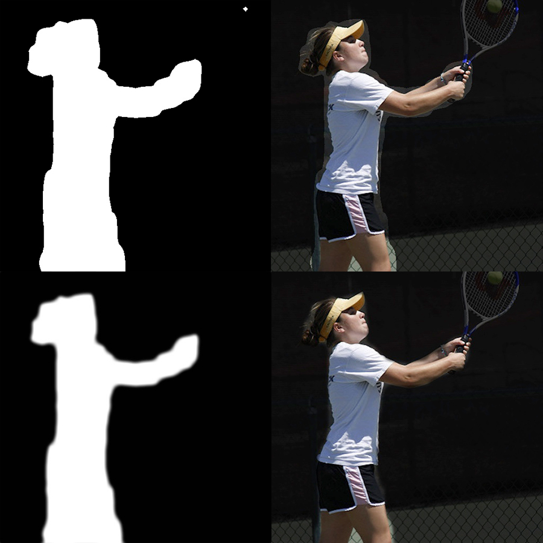
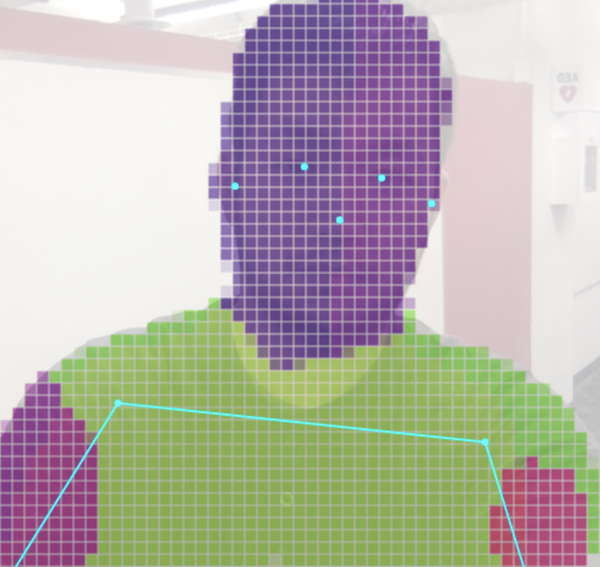
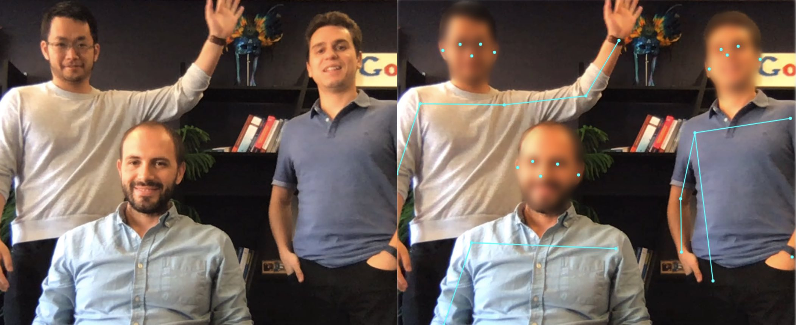

# Body Segmentation

This package provides models for running real-time body segmentation.

Currently, we provide 2 model options:

#### MediaPipe SelfieSegmentation:

MediaPipe SelfieSegmentation segments the prominent humans in the scene. It can run in real-time on both smartphones and laptops. The intended use cases include selfie effects and video conferencing, where the person is close (< 2m) to the camera.

#### BodyPix:

BodyPix can be used to segment an image into pixels that are and are not part of a person, and into pixels that belong to each of twenty-four body parts. It works for multiple people in an input image or video.

-------------------------------------------------------------------------------
## Table of Contents
1. [How to Run It](#how-to-run-it)
2. [Example Code and Demos](#example-code-and-demos)
3. [Output Visualization Utility Functions](#output-visualization-utility- functions)

-------------------------------------------------------------------------------
## How to Run It
In general there are two steps:

You first create a detector by choosing one of the models from `SupportedModels`,
including `MediaPipeSelfieSegmentation` and `BodyPix`.

For example:

```javascript
const model = bodySegmentation.SupportedModels.MediaPipeSelfieSegmentation;
const segmenterConfig = {
  runtime: 'mediapipe', // or 'tfjs'
  solutionPath: 'https://cdn.jsdelivr.net/npm/@mediapipe/selfie_segmentation',
  modelType: 'general'
}
const segmenter = await bodySegmentation.createSegmenter(model, segmenterConfig);
```

Then you can use the segmenter to segment people in the image.

```javascript
const people = await segmenter.segmentPeople(image);
```

The returned segmentation list contains the detected people in the image.
Note that it is not necessarily the case that there will be one segmentation per
one person. Each model will have its own semantics for the segmentation output.

MediaPipe SelfieSegmentation returns exactly one segmentation corresponding to all people in the input image.

BodyPix returns exactly one segmentation corresponding to all people in the input image if `multiSegmentation` option is false, and otherwise will return multiple segmentations, one per person.

Example output:
```
[
  {
    maskValueToLabel: (maskValue: number) => { return 'person' },
    mask: {
      toCanvasImageSource(): ...
      toImageData(): ...
      toTensor(): ...
      getUnderlyingType(): ...
    }
  }
]
```

The `mask` key stores an object which provides access to the underlying mask image using the conversion functions toCanvasImageSource, toImageData, and toTensor depending on the desired output type. Note that getUnderlyingType can be queried to determine what is the type being used underneath the hood to avoid expensive conversions (such as from tensor to image data).

The semantics of the RGBA values of the `mask` is as follows: the image mask is the same size as the input image, where green and blue channels are always set to 0. Different red values denote different body parts (see maskValueToLabel key below). Different alpha values denote the probability of pixel being a body part pixel (0 being lowest probability and 255 being highest).

`maskValueToLabel` maps a foreground pixel’s red value to the segmented part name of that pixel. Should throw error for unsupported input values. This is not necessarily the same across different models (for example MediaPipeSelfieSegmentation will always return 'person' since it does not distinguish individual body parts).

Refer to each model's documentation for specific configurations for the model
and their performance.

[MediaPipeSelfieSegmentation MediaPipe Documentation](https://github.com/tensorflow/tfjs-models/tree/master/body-segmentation/src/selfie_segmentation_mediapipe)

[MediaPipeSelfieSegmentation TFJS Documentation](https://github.com/tensorflow/tfjs-models/tree/master/body-segmentation/src/selfie_segmentation_tfjs)

[BodyPix Documentation](https://github.com/tensorflow/tfjs-models/tree/master/body-segmentation/src/body_pix)

-------------------------------------------------------------------------------

## Example Code and Demos
You may reference the demos for code examples. Details for how to run the demos
are included in the `demos/`
[folder](https://github.com/tensorflow/tfjs-models/tree/master/body-segmentation/demos).

## Output Visualization Utility Functions

Body Segmentation provides utility functions to help with drawing and compositing using the outputs. These utility functions are based on the ones provided by the deprecated [BodyPix Package](https://github.com/tensorflow/tfjs-models/tree/master/body-pix#output-visualization-utility-functions).

### bodySegmentation.toBinaryMask

Given a segmentation or array of segmentations, generates an image with foreground and background color at each pixel determined by the corresponding binary segmentation value at the pixel from the output.  In other words, pixels where there is a person will be colored with foreground color and where there is not a person will be colored with background color. This can be used as a mask to crop a person or the background when compositing.

#### Inputs

* **segmentation** Single segmentation or array of segmentations, such as the output from [segmentPeople](#how-to-run-it).

* **foreground** The foreground color (r,g,b,a) for visualizing pixels that belong to people.

* **background** The background color (r,g,b,a) for visualizing pixels that don't belong to people.

* **drawContour** Whether to draw the contour around each person's segmentation mask.

* **foregroundThresholdProbability** The minimum probability to color a pixel as foreground rather than background.

* **foregroundMaskValues** The red channel integer values that represent foreground (for more information refer to the `mask` [output documentation](#how-to-run-it)).

#### Returns

An [ImageData](https://developer.mozilla.org/en-US/docs/Web/API/ImageData) with the same and width height of the input segmentations, with color and opacity at each pixel determined by the corresponding binary segmentation value at the pixel from the output.


*Given the input shown in the first image above, if it is run through the API's `segmentPeople` method followed by `toBinaryMask`, An [ImageData](https://developer.mozilla.org/en-US/docs/Web/API/ImageData) that either looks like the second image above if setting `foregroundColor` to {r: 0, g: 0, b: 0, a: 0} and `backgroundColor` to {r: 0, g: 0, b: 0, a: 255} (by default), or the third image if if setting `foregroundColor` to {r: 0, g: 0, b: 0, a: 255} and `backgroundColor` to {r: 0, g: 0, b: 0, a: 0}.  This can be used to mask either the person or the background using the method `drawMask`.*

#### Example usage

```javascript
const img = document.getElementById('image');

const segmenter = await bodySegmentation.createSegmenter(bodySegmentation.SupportedModels.MediaPipeSelfieSegmentation);
const segmentation = await segmenter.segmentPeople(img);

// The mask image is an binary mask image with a 1 where there is a person and
// a 0 where there is not.
const coloredPartImage = await bodySegmentation.toBinaryMask(segmentation);
const opacity = 0.7;
const flipHorizontal = false;
const maskBlurAmount = 0;
const canvas = document.getElementById('canvas');
// Draw the mask image on top of the original image onto a canvas.
// The colored part image will be drawn semi-transparent, with an opacity of
// 0.7, allowing for the original image to be visible under.
bodySegmentation.drawMask(
    canvas, img, coloredPartImage, opacity, maskBlurAmount,
    flipHorizontal);
```

### bodySegmentation.toColoredMask

Given a segmentation or array of segmentations, and a function mapping the red pixel values (representing body part labels) to colours, generates an image with the corresponding color for each part at each pixel, and background color used where there is no part.

#### Inputs

* **segmentation** Single segmentation or array of segmentations, such as the output from [segmentPeople](#how-to-run-it).

* **maskValueToColor** A function mapping red channel mask values to colors to use in output image (for more information refer to the `mask` [output documentation](#how-to-run-it)). If using bodyPix with `segmentBodyParts` on, then `bodySegmentation.bodyPixMaskValueToRainbowColor` can be used as a default.

* **background** The background color (r,g,b,a) for visualizing pixels that don't belong to people.

* **foregroundThresholdProbability** The minimum probability to color a pixel as foreground rather than background.

#### Returns

An [ImageData](https://developer.mozilla.org/en-US/docs/Web/API/ImageData) with the same width and height of the input segmentations, with the corresponding color for each part at each pixel, and the background color where there is no part.

#### Example usage

```javascript
const img = document.getElementById('image');

const segmenter = await bodySegmentation.createSegmenter(bodySegmentation.SupportedModels.BodyPix);
const segmentation = await segmenter.segmentPeople(img, {multiSegmentation: false, segmentBodyParts: true});

// The colored part image is an rgb image with a corresponding color from the
// rainbow colors for each part at each pixel, and black pixels where there is
// no part.
const coloredPartImage = await bodySegmentation.toColoredMask(segmentation, bodySegmentation.bodyPixMaskValueToRainbowColor, {r: 255, g: 255, b: 255, a: 255}));
const opacity = 0.7;
const flipHorizontal = false;
const maskBlurAmount = 0;
const canvas = document.getElementById('canvas');
// Draw the colored part image on top of the original image onto a canvas.
// The colored part image will be drawn semi-transparent, with an opacity of
// 0.7, allowing for the original image to be visible under.
bodySegmentation.drawMask(
    canvas, img, coloredPartImage, opacity, maskBlurAmount,
    flipHorizontal);
```


*Given the input shown in the first image above, if it is run through the api using the BodyPix model and the `segmentPeople` method, followed by `toColoredMask`, then a 'spectral' or 'rainbow' color scale in `toColoredMask` will produce an `ImageData` that looks like the second image or the third image above.*

### bodySegmentation.drawMask

Draws an image onto a canvas and draws an `ImageData` containing a mask on top of it with a specified opacity; The `ImageData` is typically generated using `toBinaryMask` or `toColoredMask`.

#### Inputs

* **canvas** The canvas to be drawn onto.
* **image** The original image to apply the mask to.
* **maskImage** An ImageData containing the mask.  Ideally this should be generated by `toBinaryMask` or `toColoredMask.`
* **maskOpacity** The opacity when drawing the mask on top of the image. Defaults to 0.7. Should be a float between 0 and 1.
* **maskBlurAmount** How many pixels to blur the mask by. Defaults to 0. Should be an integer between 0 and 20.
* **flipHorizontal** If the result should be flipped horizontally.  Defaults to false.

#### Example usage

```javascript
const img = document.getElementById('image');

const segmenter = await bodySegmentation.createSegmenter(bodySegmentation.SupportedModels.MediaPipeSelfieSegmentation);
const segmentation = await segmenter.segmentPeople(img);

// Convert the segmentation into a mask to darken the background.
const foregroundColor = {r: 0, g: 0, b: 0, a: 0};
const backgroundColor = {r: 0, g: 0, b: 0, a: 255};
const backgroundDarkeningMask = await bodySegmentation.toBinaryMask(
    segmentation, foregroundColor, backgroundColor);

const opacity = 0.7;
const maskBlurAmount = 3;
const flipHorizontal = false;
const canvas = document.getElementById('canvas');
// Draw the mask onto the image on a canvas.  With opacity set to 0.7 and
// maskBlurAmount set to 3, this will darken the background and blur the
// darkened background's edge.
await bodySegmentation.drawMask(
    canvas, img, backgroundDarkeningMask, opacity, maskBlurAmount, flipHorizontal);
```



*The above shows drawing a mask generated by `toBinaryMask` on top of an image and canvas using `drawMask`.  In this case, `segmentationThreshold` was set to a lower value of 0.25, making the mask include more pixels.  The top two images show the mask drawn on top of the image, and the second two images show the mask blurred by setting  `maskBlurAmount` to 9 before being drawn onto the image, resulting in a smoother transition between the person and the masked background.*

### bodySegmentation.drawPixelatedMask

Draws an image onto a canvas and draws an `ImageData` containing a mask on top of it with a specified opacity; The `ImageData` is typically generated using `toColoredMask`. Different from `drawMask`, this rendering function applies the pixelation effect to the body part segmentation prediction. This allows a user to display low resolution body part segmentation and thus offers an aesthetic interpretation of the body part segmentation prediction.

#### Inputs

* **canvas** The canvas to be drawn onto.
* **image** The original image to apply the mask to.
* **maskImage** An ImageData containing the mask.  Ideally this should be generated by `toColoredMask`.
* **maskOpacity** The opacity when drawing the mask on top of the image. Defaults to 0.7. Should be a float between 0 and 1.
* **maskBlurAmount** How many pixels to blur the mask by. Defaults to 0. Should be an integer between 0 and 20.
* **flipHorizontal** If the result should be flipped horizontally.  Defaults to false.
* **pixelCellWidth** The width of each pixel cell. Default to 10 px.

#### Example usage

```javascript
const img = document.getElementById('image');

const segmenter = await bodySegmentation.createSegmenter(bodySegmentation.SupportedModels.BodyPix);
const segmentation = await segmenter.segmentPeople(img, {multiSegmentation: false, segmentBodyParts: true});

// The colored part image is an rgb image with a corresponding color from the
// rainbow colors for each part at each pixel, and white pixels where there is
// no part.
const coloredPartImage = await bodySegmentation.toColoredMask(segmentation, bodySegmentation.bodyPixMaskValueToRainbowColor, {r: 255, g: 255, b: 255, a: 255}));
const opacity = 0.7;
const flipHorizontal = false;
const maskBlurAmount = 0;
const pixelCellWidth = 10.0;
const canvas = document.getElementById('canvas');
// Draw the pixelated colored part image on top of the original image onto a
// canvas.  Each pixel cell's width will be set to 10 px. The pixelated colored
// part image will be drawn semi-transparent, with an opacity of 0.7, allowing
// for the original image to be visible under.
await bodySegmentation.drawPixelatedMask(
    canvas, img, coloredPartImage, opacity, maskBlurAmount,
    flipHorizontal, pixelCellWidth);
```



*The pixelation effect is applied to part image using `drawPixelatedMask`; the result is shown in the image above.*

### bodySegmentation.drawBokehEffect

Given a segmentation or array of segmentations, and an image, draws the image with its background blurred onto a canvas.

An example of applying a [bokeh effect](https://www.nikonusa.com/en/learn-and-explore/a/tips-and-techniques/bokeh-for-beginners.html):


#### Inputs

* **canvas** The canvas to draw the background-blurred image onto.
* **image** The image to blur the background of and draw.
* **segmentation** Single segmentation or array of segmentations.
* **foregroundThreshold** The minimum probability to color a pixel as foreground
rather than background.  Defaults to 0.5. Should be a number between 0 and 1.
* **backgroundBlurAmount** How many pixels in the background blend into each
other.  Defaults to 3. Should be an integer between 1 and 20.
* **edgeBlurAmount** How many pixels to blur on the edge between the person
and the background by.  Defaults to 3. Should be an integer between 0 and 20.
* **flipHorizontal** If the output should be flipped horizontally. Defaults to false.

#### Example Usage

```javascript
const img = document.getElementById('image');

const segmenter = await bodySegmentation.createSegmenter(bodySegmentation.SupportedModels.MediaPipeSelfieSegmentation);
const segmentation = await segmenter.segmentPeople(img);

const foregroundThreshold = 0.5;
const backgroundBlurAmount = 3;
const edgeBlurAmount = 3;
const flipHorizontal = false;

const canvas = document.getElementById('canvas');
// Draw the image with the background blurred onto the canvas. The edge between
// the person and blurred background is blurred by 3 pixels.
await bodySegmentation.drawBokehEffect(
    canvas, img, segmentation, foregroundThreshold, backgroundBlurAmount,
    edgeBlurAmount, flipHorizontal);
```


*The above shows the process of applying a 'bokeh' effect to an image (the left-most one) with `drawBokehEffect`.  An **inverted** mask is generated from a `Segmentation`.  The original image is then drawn onto the canvas, and using the [canvas compositing](https://developer.mozilla.org/en-US/docs/Web/API/CanvasRenderingContext2D/globalCompositeOperation) operation `destination-over` the mask is drawn onto the canvas, causing the background to be removed.  The original image is blurred and drawn onto the canvas where it doesn't overlap with the existing image using the compositing operation `destination-over`.  The result is seen in the right-most image.*

### bodySegmentation.blurBodyPart

Given a segmentation or array of segmentations, and an image, blurs some person body parts (e.g. left face and right face).

An example of applying a body part blur on `left_face` and `right_face` body parts for BodyPix model (other body parts can be specified):




#### Inputs

* **canvas** The canvas to draw the body-part blurred image onto.
* **image** The image with people to blur the body-part and draw.
* **segmentation** Single segmentation or array of segmentations.
* **maskValuesToBlur** An array of red channel mask values to blur (representing different body parts, refer to `Segmentation` interface for more details).
* **foregroundThreshold** The minimum probability to color a pixel as foreground
rather than background.  Defaults to 0.5. Should be a number between 0 and 1.
* **backgroundBlurAmount** How many pixels in the background blend into each
other.  Defaults to 3. Should be an integer between 1 and 20.
* **edgeBlurAmount** How many pixels to blur on the edge between the person
and the background by.  Defaults to 3. Should be an integer between 0 and 20.
* **flipHorizontal** If the output should be flipped horizontally. Defaults to false.

#### Example Usage

```javascript
const img = document.getElementById('image');

const segmenter = await bodySegmentation.createSegmenter(bodySegmentation.SupportedModels.BodyPix);
const segmentation = await segmenter.segmentPeople(img, {multiSegmentation: false, segmentBodyParts: true});

const foregroundThreshold = 0.5;
const backgroundBlurAmount = 3;
const edgeBlurAmount = 3;
const flipHorizontal = false;
const faceBodyPartIdsToBlur = [0, 1];

const canvas = document.getElementById('canvas');

await bodySegmentation.blurBodyPart(
    canvas, img, partSegmentation, faceBodyPartIdsToBlur, foregroundThreshold,
    backgroundBlurAmount, edgeBlurAmount, flipHorizontal);
```
