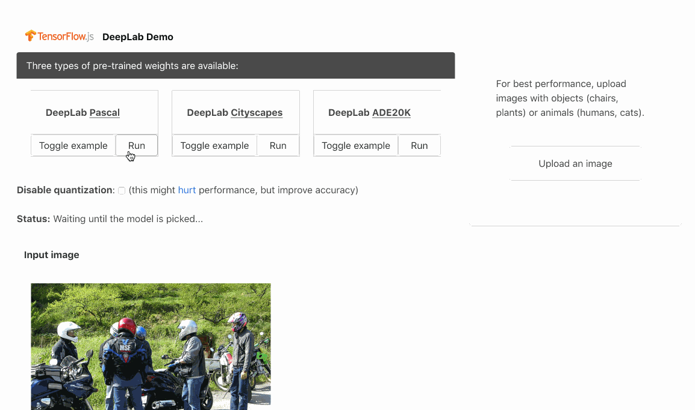

# Semantic Segmentation in the Browser: DeepLab Model

This package contains a standalone implementation of the DeepLab inference pipeline, as well as a [demo](./demo), for running semantic segmentation using TensorFlow.js.



## Usage

In the first step of semantic segmentation, an image is fed through a pre-trained model [based](https://github.com/tensorflow/models/blob/master/research/deeplab/g3doc/model_zoo.md) on MobileNet-v2. Three types of pre-trained weights are available, trained on [Pascal](http://host.robots.ox.ac.uk/pascal/VOC/), [Cityscapes](https://www.cityscapes-dataset.com) and [ADE20K](https://groups.csail.mit.edu/vision/datasets/ADE20K/) datasets.

To get started, pick the model name from `pascal`, `cityscapes` and `ade20k`, and decide whether you want your model quantized to 16 bits. Then, initialise the model as follows:

```typescript
import { SemanticSegmentation } from '@tensorflow-models/deeplab';
const model = 'pascal';   // set to your preferred model, out of `pascal`, `cityscapes` and `ade20k`
const isQuantized = true; // set to your preference
const deeplab = SemanticSegmentation(model, isQuantized);
```

The download of weights begins automatically.

### Segmenting an Image

The `predict` method of the `SemanticSegmentation` object covers most use cases.

The following twenty one objects are recognized and labelled according to the order of appearance:

* background
* aeroplane
* bicycle
* bird
* boat
* bottle
* bus
* car
* cat
* chair
* cow
* dining table
* dog
* horse
* motorbike
* person
* potted plant
* sheep
* sofa
* train
* TV

Pass an optional canvas element as `canvas` to draw the output as a side effect.

#### Segmentation input

* **image** :: DeepLabInput | ImageData | HTMLImageElement | HTMLCanvasElement | HTMLVideoElement | tf.Tensor3D;
* **canvas** (optional) :: HTMLCanvasElement

#### Segmentation output

* **[Legend, height, width, Uint8ClampedArray]** :: Promise<DeepLabOutput | [{ [name: string]: [number, number, number] }, number, number, Uint8ClampedArray]>

#### Segmentation example

```typescript
const classify = async (image) => {
    return await model.predict(image);
}
```

**Note**: *For more granular control, consider `segment` and `translate` methods described below.*

### Producing a Semantic Segmentation Map

To segment an arbitrary image and generate a two-dimensional tensor with class labels assigned to each cell of the grid overlayed on the image (with the maximum number of cells on the side fixed to 513), use the `segment` method of the `SemanticSegmentation` object.

#### `model.segment` input

* **image** :: DeepLabInput | ImageData | HTMLImageElement | HTMLCanvasElement | HTMLVideoElement | tf.Tensor3D;

#### `model.segment` output

* **rawSegmentationMap** :: Promise<RawSegmentationMap> | Promise<tf.Tensor2D>

#### `model.segment` example

```javascript
const getSemanticSegmentationMap = async (image) => {
    return await model.segment(image)
}
```

### Translating a Segmentation Map into the Color-Labelled Image

To transform the segmentation map into a coloured image, use the `translate` method of the `SemanticSegmentation` object. Pass an optional canvas element as `canvas` to draw the output as a side effect.

#### `model.translate` input

* **segmentationMap** :: RawSegmentationMap | tf.Tensor2D
* **canvas** (optional) :: HTMLCanvasElement

#### `model.translate` output

* **rawSegmentationMap** :: Promise<SegmentationData> | Promise<[{ [name: string]: [ number, number, number] }, Uint8ClampedArray]>

#### `model.translate` example

```javascript
const translateSegmentationMap = async (segmentationMap) => {
    return await model.translate(segmentationMap)
}
```

## Contributing to the Demo

Please see the demo [documentation](./demo/README.md).

## Technical Details

This model is based on the TensorFlow [implementation](https://github.com/tensorflow/models/tree/master/research/deeplab) of DeepLab. You might want to inspect the [conversion script](./convert_deeplab.sh), or download original pre-trained weights [here](https://github.com/tensorflow/models/blob/master/research/deeplab/g3doc/model_zoo.md).
