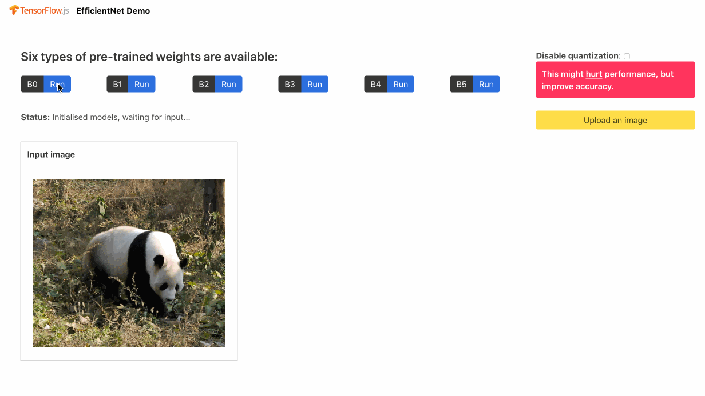

# EfficientNet: Low-Power, Low-Latency Image Classification in the Browser

This repository contains a TensorFlow.js port of **EfficientNet**, a lightweight convolutional neural network architecture achieving the [state-of-the-art accuracy with an order of magnitude fewer parameters and FLOPS](https://arxiv.org/abs/1905.11946), on both ImageNet and
five other commonly used transfer learning datasets.



This TensorFlow.js model does not require you to know about machine learning.
It can take as input any browser-based image elements (``, `<video>` and `<canvas>`
elements, for example) and return an array of most likely predictions and
their confidences.

## Usage

To get started, pick the model variant from `b0`, `b1`, `b2`, `b3`, `b4`, and `b5`, and decide whether you want your model quantized to 16 bits. Then, initialise the model as follows:

```typescript
import { EfficientNet } from '@tensorflow-models/efficientnet';
const model = 'b0';       // set to your preferred model, out of `b0`, `b1`, `b2`, `b3`, `b4`, and `b5`.
const isQuantized = true; // set to your preference
const deeplab = new SemanticSegmentation(model, isQuantized);
```

The download of weights begins automatically. You can start using the model immediately.

### Classifying an Image

The model recognizes [1000 ImageNet](https://github.com/sdll/tfjs-models/blob/4b3e32c0aa8374e1c38d4f248c84e38fd0af81ab/efficientnet/src/config.ts#L32) classes.

#### Classification input

Pass the input image and the number of classes to show:

* **image** :: `EfficientNetInput | ImageData | HTMLImageElement | HTMLCanvasElement | HTMLVideoElement | tf.Tensor3D`;
* **topK** :: `number`

#### Classification output

The output is a promise of `EfficientNetOutput`, the array of `ClassPrediction` objects with the following attributes:

* **className** :: `ClassLabel | string`;
* **probability** :: `Probability | number`;

#### Classification example

```typescript
const classify = async (image) => {
    return await model.predict(image);
}
```

## Contributing to the Demo

Please see the demo [documentation](./demo/README.md).

## Technical Details

EfficientNets rely on AutoML and compound scaling to achieve superior performance without compromising resource efficiency. The [AutoML Mobile framework](https://ai.googleblog.com/2018/08/mnasnet-towards-automating-design-of.html) has helped develop a mobile-size baseline network, **EfficientNet-B0**, which is then improved by the compound scaling method  to obtain EfficientNet-B1 to B7.

<table border="0">
<tr>
    <td>
    
    </td>
    <td>
    
    </td>
</tr>
</table>

EfficientNets achieve state-of-the-art accuracy on ImageNet with an order of magnitude better efficiency:

* In high-accuracy regime, EfficientNet-B7 achieves the state-of-the-art 84.4% top-1 / 97.1% top-5 accuracy on ImageNet with 66M parameters and 37B FLOPS. At the same time, the model is 8.4x smaller and 6.1x faster on CPU inference than the former leader, [Gpipe](https://arxiv.org/abs/1811.06965).

* In middle-accuracy regime, EfficientNet-B1 is 7.6x smaller and 5.7x faster on CPU inference than [ResNet-152](https://arxiv.org/abs/1512.03385), with similar ImageNet accuracy.

* Compared to the widely used [ResNet-50](https://arxiv.org/abs/1512.03385), EfficientNet-B4 improves the top-1 accuracy from 76.3% of ResNet-50 to 82.6% (+6.3%), under similar FLOPS constraints.

This model is based on the Keras [implementation](https://github.com/qubvel/efficientnet) of EfficientNet. You might want to inspect the [conversion script](./scripts/convert_efficientnet.sh), or download original TensorFlow checkpoints [here](https://github.com/tensorflow/tpu/tree/master/models/official/efficientnet). To convert the weights locally, run the script as follows, replacing `dist` with the target directory:

```bash
./scripts/convert_deeplab.sh --target_dir=dist --use_venv=t
```

Run the usage helper to learn more about the options:

```bash
./scripts/convert_deeplab.sh -h
```
