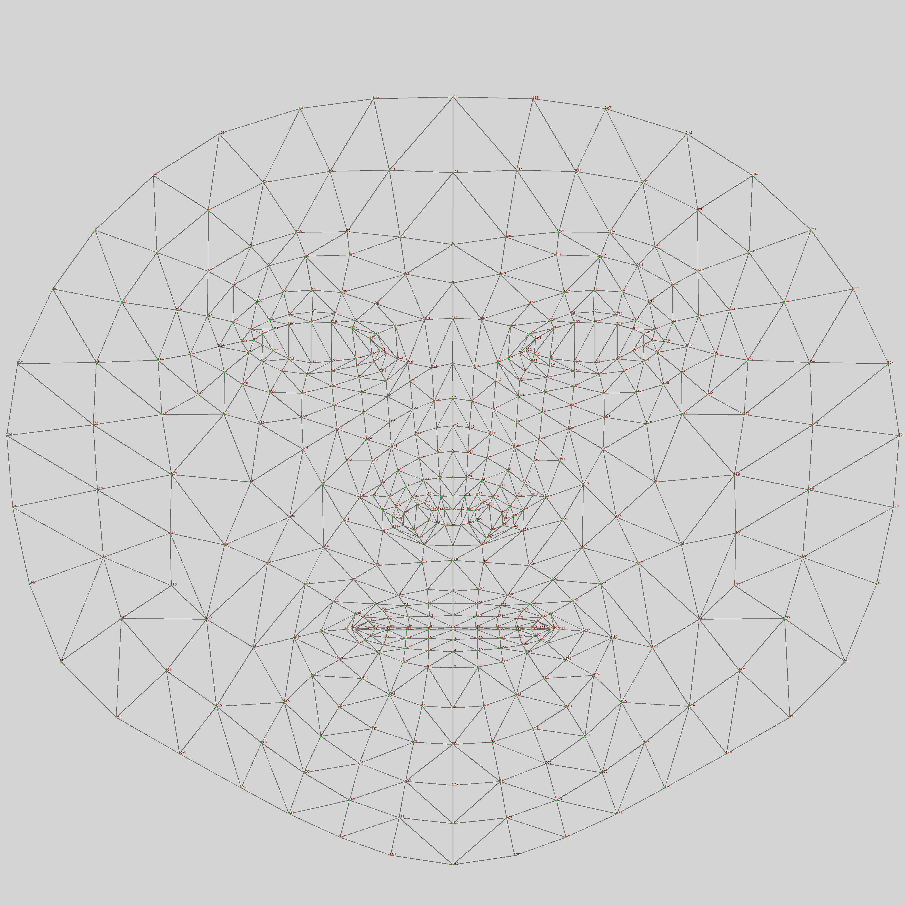

# Face Landmarks Detection

This package provides models for running real-time face detection and landmark tracking.

Currently, we provide 1 model option:

#### MediaPipe:
[Demo](https://storage.googleapis.com/tfjs-models/demos/face-landmarks-detection/index.html?model=mediapipe_face_mesh)

MediaPipe Facemesh can detect multiple faces, each face contains 468 keypoints.

More background information about the package, as well as its performance characteristics on different datasets, can be found here: [Model Card](https://drive.google.com/file/d/1QvwWNfFoweGVjsXF3DXzcrCnz-mx-Lha/preview). The facemesh package optionally loads an iris detection model, whose model card can be found here: [Model Card](https://drive.google.com/file/d/1tV7EJb3XgMS7FwOErTgLU1ZocYyNmwlf/preview).

-------------------------------------------------------------------------------
## Table of Contents
1. [How to Run It](#how-to-run-it)
2. [Keypoint Diagram](#keypoint-diagram)
3. [Example Code and Demos](#example-code-and-demos)

-------------------------------------------------------------------------------
## How to Run It
In general there are two steps:

You first create a detector by choosing one of the models from `SupportedModels`, including `MediaPipeFaceMesh`.

For example:

```javascript
const model = faceLandmarksDetection.SupportedModels.MediaPipeFaceMesh;
const detectorConfig = {
  runtime: 'mediapipe', // or 'tfjs'
  solutionPath: 'https://cdn.jsdelivr.net/npm/@mediapipe/face_mesh',
}
const detector = await faceLandmarksDetection.createDetector(model, detectorConfig);
```

Then you can use the detector to detect faces.

```
const faces = await detector.estimateFaces(image);
```

The returned face list contains detected faces for each faces in the image.
If the model cannot detect any faces, the list will be empty.

For each face, it contains a bounding box of the detected face, as well as an array of keypoints.
MediaPipeFaceMesh returns 468 keypoints.
Each keypoint contains x and y, as well as a name.

Example output:
```
[
  {
    box: {
      xMin: 304.6476503248806,
      xMax: 502.5079975897382,
      yMin: 102.16298762367356,
      yMax: 349.035215984403,
      width: 197.86034726485758,
      height: 246.87222836072945
    },
    keypoints: [
      {x: 406.53152857172876, y: 256.8054528661723, z: 10.2, name: "lips"},
      {x: 406.544237446397, y: 230.06933367750395, z: 8},
      ...
    ],
  }
]
```

The `box` represents the bounding box of the face in the image pixel space, with `xMin`, `xMax` denoting the x-bounds, `yMin`, `yMax` denoting the y-bounds, and `width`, `height` are the dimensions of the bounding box.

For the `keypoints`, x and y represent the actual keypoint position in the image pixel space. z represents the depth with the center of the head being the origin, and the smaller the value the closer the keypoint is to the camera. The magnitude of z uses roughly the same scale as x.

The name provides a label for some keypoint, such as 'lips', 'leftEye', etc. Note that not each keypoint will have a label.

Refer to each model's documentation for specific configurations for the model
and their performance.

[MediaPipeFaceMesh MediaPipe Documentation](https://github.com/tensorflow/tfjs-models/tree/master/face-landmarks-detection/src/mediapipe)

[MediaPipeFaceMesh TFJS Documentation](https://github.com/tensorflow/tfjs-models/tree/master/face-landmarks-detection/src/tfjs)

-------------------------------------------------------------------------------

## Keypoint Diagram
See the diagram below for what those keypoints are and their index in the array.

### MediaPipe FaceMesh Keypoints



-------------------------------------------------------------------------------

## Example Code and Demos
You may reference the demos for code examples. Details for how to run the demos
are included in the `demos/`
[folder](https://github.com/tensorflow/tfjs-models/tree/master/face-landmarks-detection/demos).
