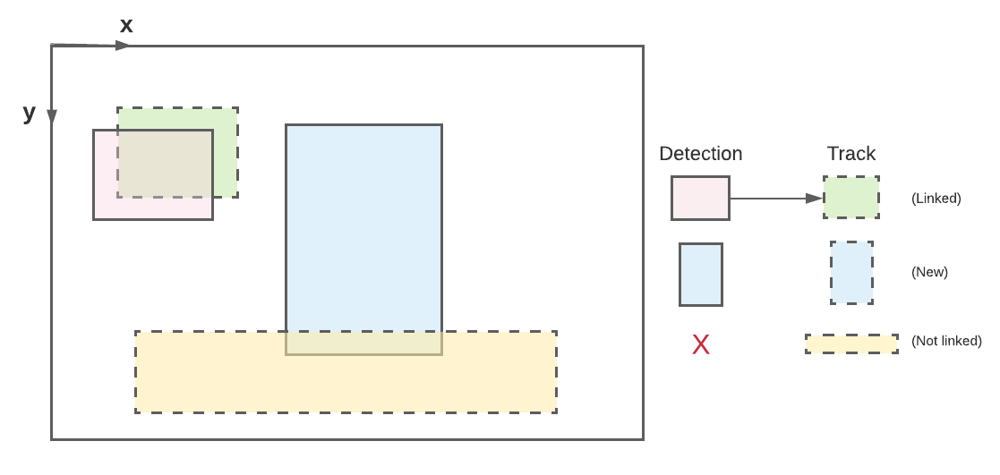

# Trackers

The purpose of *detection* is to locate objects in a frame; but there is no
association of objects from one frame to the next. To understand whether object
*k* in frame *t* corresponds to a detected object in frame *t-1*, we must employ
a *tracker*.

Why would we want a tracker? Well, in a multi-person detection setting, it is
often useful to keep track of who is who. Imagine an application where two
people are competing in a live jumping jack competition. Simply detecting both
individuals in each frame is not sufficient for the application, since we must
maintain the identity of each detection and accumulate state (in this case the
number of jumping jacks).

A tracker is an algorithm that (typically) runs downstream of detection. The
tracker maintains a history of objects (i.e. *tracks*), and its objective is to
*link* incoming detections with these tracks (and spawn new tracks or kill old
ones).

To adequately match incoming detections with preexisting tracks, we must have a
measure that scores the similarity:

Once we have a 2d matrix that contains pairwise scores from all detections in
the current frame against all stored tracks in the tracker, we can solve an
optimization procedure (a *matching algorithm*) to associate specific detections
with specific tracks.

When the input detections are bounding boxes, a simple (and effective) choice
for a similarity measure is
[intersection-over-union](https://en.wikipedia.org/wiki/Jaccard_index) (IoU). If
the detections contain keypoints, one can use
[Object Keypoint Similarity](https://cocodataset.org/#keypoints-eval) to score
the similarity of one pose to another.

The following figure shows an example of linking detections (solid boundaries)
with preexisting tracks (dotted boundaries).

  

Note that one detection is successfully linked with a track, while the other is
not linked, due to a very low IoU. In this case, a new track is created for the
unmatched detection. The track that was not linked stays in storage,
but has the potential to be deleted in the future if no detections are
associated with it.

To build your own tracker, subclass `Tracker` in
[tracker.ts](https://github.com/tensorflow/tfjs-models/tree/master/pose-detection/src/calculators/tracker.ts).
To see other implemented trackers, check out
[keypoint_tracker.ts](https://github.com/tensorflow/tfjs-models/tree/master/pose-detection/src/calculators/keypoint_tracker.ts)
and
[bounding_box_tracker.ts](https://github.com/tensorflow/tfjs-models/tree/master/pose-detection/src/calculators/bounding_box_tracker.ts).

Learn more about how to configure a tracker in
[config_interfaces.ts](https://github.com/tensorflow/tfjs-models/tree/master/pose-detection/src/calculators/interfaces/config_interfaces.ts).
