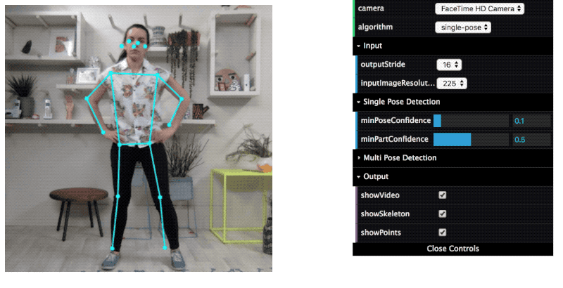

# PoseNet Demos

## Contents

### Demo 1: Camera

The camera demo shows how to estimate poses in real-time from a webcam video stream.

### Demo 2: Coco Images

The [coco images](http://cocodataset.org/#home) demo shows how to estimate poses in images. It also illustrates the differences between the single-person and multi-person pose detection algorithms. 

## Setup

From the `posenet` folder run:

    yarn

Cd into the demos folder

    cd demos

Install dependencies and prepare the build directory:

    yarn

To watch files for changes, and launch a dev server:

    yarn watch