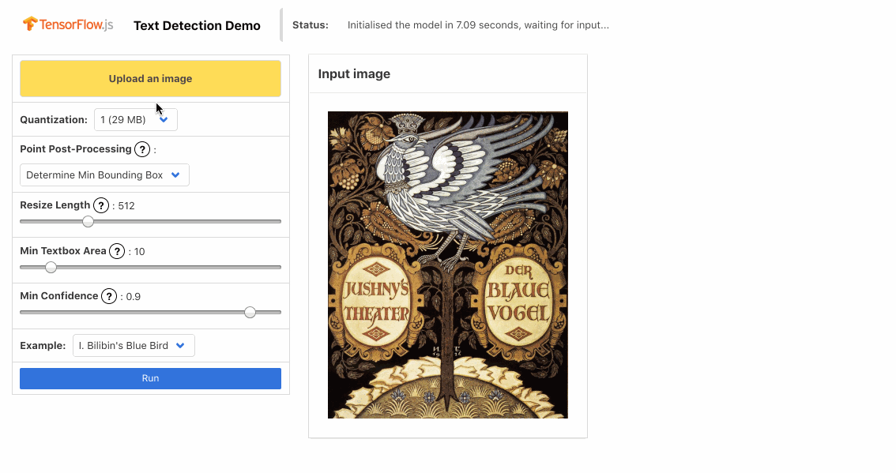
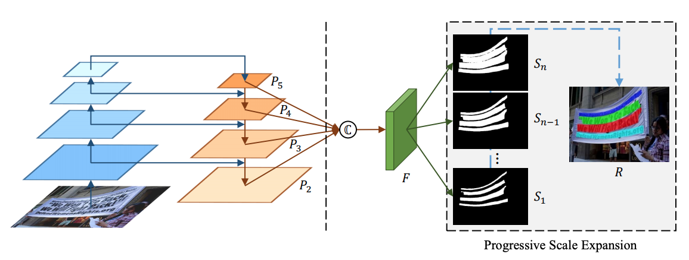

# In-Browser Shape-Robust Text Detection with Progressive Scale Expansion Network

## This model is a work-in-progress and has not been released yet. We will update this README when the model is released and usable



This package contains a standalone implementation of the text detection pipeline based on [PSENet](https://github.com/liuheng92/tensorflow_PSENet), as well as a demo, identifying text instances of arbirtrary shape.

Using the model does not require any specific knowledge about machine learning. It can take any browser-based image elements (``, `<video>` and `<canvas>` elements, for example) as input return an array of bounding boxes.

## Usage

Four parameters affect the accuracy, precision and speed of inference:

* **degree of quantization**

  Three types of weights are supported by default, quantized either to 1, 2 or 4 bytes respectively. The greater the degree of quantization, the less the size of the model and the precision of the output.

* **resize length**

  The input image is [resized](./src/utils.ts#L133) before being processed by the model. The greater the length limiting the maximum side of the resized image, the more accurate the results, but the inference takes significantly more time and memory.

* **minimum textbox area**

  Increasing this parameter, you can avoid spurious predictions, improving their accuracy.

* **minimum confidence**

  As an intermediate step, the model generates confidence levels to dermine whether each pixel represents text or not. Setting this threshold to higher values might improve the robustness of predictions.

To get started, decide whether you want your model quantized to 1 or 2 bytes (set the `quantizationBytes` option to 4 if you wish to disable it). Then, initialize the model as follows:

```typescript
import {createCanvas} from 'canvas';
import * as psenet from '@tensorflow-models/text-detection';
const loadModel = async () => {
  const quantizationBytes = 2;  // either 1, 2 or 4
  return await psenet.load({quantizationBytes});
};

// this empty canvas serves as an example input
const input = createCanvas(200, 200);
// ...

loadModel()
    .then((model) => model.detect(input))
    .then(
        (boxes) =>
            console.log(`The predicted text boxes are ${JSON.stringify(boxes)}`));
```

By default, calling `load` initalizes the model without quantization.

If you would rather load custom weights, you can pass the URL in the config instead:

```typescript
import * as psenet from '@tensorflow-models/text-detection';
const loadModel = async () => {
  const url = 'https://storage.googleapis.com/gsoc-tfjs/models/text-detection/quantized/1/psenet/model.json';
  return await psenet.load({modelUrl: url});
};
loadModel().then(() => console.log(`Loaded the model successfully!`));
```

This will initialize and return the `TextDetection` model.

If you require more careful control over the initialization and behavior of the model, use the `TextDetection` class, passing a pre-loaded `GraphModel` in the constructor:

```typescript
import * as tfconv from '@tensorflow/tfjs-converter';
import * as psenet from '@tensorflow-models/text-detection';
const loadModel = async () => {
  const quantizationBytes = 2;  // either 1, 2 or 4
  // use the getURL utility function to get the URL to the pre-trained weights
  const modelUrl = psenet.getURL(quantizationBytes);
  const rawModel = await tfconv.loadGraphModel(modelUrl);
  return new psenet.TextDetection(rawModel);
};
loadModel().then(() => console.log(`Loaded the model successfully!`));
```

### Detecting Text

The `detect` method of the `TextDetection` object covers most use cases.

#### `model.detect(image, config?)` inputs

* **image** :: `ImageData | HTMLImageElement | HTMLCanvasElement | HTMLVideoElement | tf.Tensor3D`;

  The image with text

* **config.minTextBoxArea** (optional) :: `number`

  Text boxes with areas less than this value are ignored. Equal to **10** by default.

* **config.minTextConfidence** (optional) :: `number`

  Minimum allowable confidence of the prediction that a region corresponds to text. Set to **0.94** by default.

* **config.minPixelSalience** (optional) :: `number`

  Minimum threshold above which the predicted logits are interpreted as text.  Set to **1** by default.

* **config.resizeLength** (optional) :: `number`

  The greater the length, the better accuracy and precision you might get at the cost of performance. Set to **256** by default.

  **Note**: *This is the first parameter to fine-tune in order to improve the speed of inference. Setting this value to more than 352 might result in memory overflow.*

* **config.processPoints** (optional) :: `(points: ({x:number, y:number})[]) => ({x:number, y:number})[]`

  The method generalizing the set of text pixels to a shape. Two processing functions are supported out of the box:

  * The default `minAreaRect` [computes](./src/minAreaRect.ts#L50) the minimum bounding box

  * `convexHull` returns the convex hull of the input points

  You can test both as follows:

  ```typescript
    import {minAreaRect, convexHull} from "@tensorflow-models/text-detection";
    const points = [[1, 1], [-1, 1], [0, 0], [-1, -1], [1, -1], [5, 5]];
    console.log(`The points are: ${JSON.stringify(points)}`);
    console.log(`The convex hull is: ${JSON.stringify(convexHull(points))})`;
    console.log(`The min bounding box is: ${JSON.stringify(minAreaRect(points))})`;
  ```

* **config.debug** (optional) :: `boolean`

  Enables printing of the information for debugging purposes. Set to **false** by default.

#### `model.detect(image, config?)` outputs

The output is a promise of an array with individual boxes, represented as an array of points (objects with `x` and `y` attributes).

#### `model.detect(image, config?)` example

```typescript
const computeTextBoxes = async (image) => {
    return await model.detect(image);
}
```

**Note**: *For more granular control, consider `predict` and `convertKernelsToBoxes` methods described below.*

### Generating minimal scale kernels

To compute the raw predictions of PSENet with the image pre-processed for optimal inference, use the `model.predict(image, resizeLength?)` method.

#### `model.predict(image, resizeLength?)` inputs

* **image** :: `ImageData | HTMLImageElement | HTMLCanvasElement | HTMLVideoElement | tf.Tensor3D`;

  The image with text

* **config.resizeLength** (optional) :: `number`

  The greater the length, the better accuracy and precision you might get at the cost of performance. Set to **256** by default.

  **Note**: *This is the first parameter to fine-tune in order to improve the speed of inference. Setting this value to more than 576 might result in memory overflow.*

#### `model.predict(image, resizeLength?)` output

* **kernels** :: `tf.Tensor3D`

The minimal scale kernels of shape `(image height, image width, 6)`.

#### `model.predict(image, resizeLength?)` example

```javascript
const resizeLength = 256;
const computeKernels = (image) => {
    return model.predict(image, 256)
}
```

### Extracting Text Regions From Kernels

To transform the segmentation map into a coloured image, use the `convertKernelsToBoxes` method.

#### `convertKernelsToBoxes(kernelScores, originalHeight, originalWidth, config?)` inputs

* **kernelScores** :: `tf.Tensor3D`

The minimal scale kernels of shape `(image height, image width, 6)`.

* **originalHeight** :: `number`

The original height of the input image

* **originalWidth** :: `number`

The original width of the input image

* **config.minTextConfidence** (optional) :: `number`

  Minimum allowable confidence of the prediction that a region corresponds to text. Set to **0.94** by default.

* **config.minPixelSalience** (optional) :: `number`

  Minimum threshold above which the predicted logits are interpreted as text.  Set to **1** by default.

* **config.resizeLength** (optional) :: `number`

  The greater the length, the better accuracy and precision you might get at the cost of performance. Set to **256** by default.

  **Note**: *This is the first parameter to fine-tune in order to improve the speed of inference. Setting this value to more than 576 might result in memory overflow.*

* **config.processPoints** (optional) :: `(points: ({x:number, y:number})[]) => ({x:number, y:number})[]`

  The method generalizing the set of text pixels to a shape. Two processing functions are supported out of the box:

  * The default `minAreaRect` [computes](./src/minAreaRect.ts#L50) the minimum bounding box

  * `convexHull` returns the convex hull of the input points

  You can test both as follows:

  ```typescript
    import {minAreaRect, convexHull} from "@tensorflow-models/text-detection";
    const points = [[1, 1], [-1, 1], [0, 0], [-1, -1], [1, -1], [5, 5]];
    console.log(`The points are: ${JSON.stringify(points)}`);
    console.log(`The convex hull is: ${JSON.stringify(convexHull(points))})`;
    console.log(`The min bounding box is: ${JSON.stringify(minAreaRect(points))})`;
  ```

#### `convertKernelsToBoxes(kernelScores, originalHeight, originalWidth, config?)` outputs

  A promise of an array with individual boxes, represented as an array of points (objects with `x` and `y` attributes).

#### `convertKernelsToBoxes(kernelScores, originalHeight, originalWidth, config?)` example

  ```typescript
  import {createCanvas} from 'canvas';
  import * as psenet from '@tensorflow-models/text-detection';
  const loadModel = async () => {
    const quantizationBytes = 2;  // either 1, 2 or 4
    return await psenet.load({quantizationBytes});
  };

  // this empty canvas serves as an example input
  const input = createCanvas(200, 200);
  const processPoints = psenet.convexHull;
  // ...

  loadModel()
      .then((model) => model.predict(input))
      .then(
          (kernelScores) => psenet.convertKernelsToBoxes(
              kernelScores, input.height, input.width, {processPoints}))
      .then(
          (boxes) => console.log(
              `The predicted text boxes are ${JSON.stringify(boxes)}`));
  ```

## Technical Details

PSENet operates in two steps (see the latest paper [here](https://arxiv.org/abs/1903.12473)):



* First, the model resizes the input and generates a series of two-dimensional *minimal scale kernels* (the current implementation yields 6), all having the same size as the scaled input.

* The Progressive Scale Expansion algorithm (PSE) then processes these kernels, extracting text pixels.

Due to the fact that each minimal scale kernel stores distinctive information about the geometry of the original image, this method is effective for differentiating between close neighbours.
