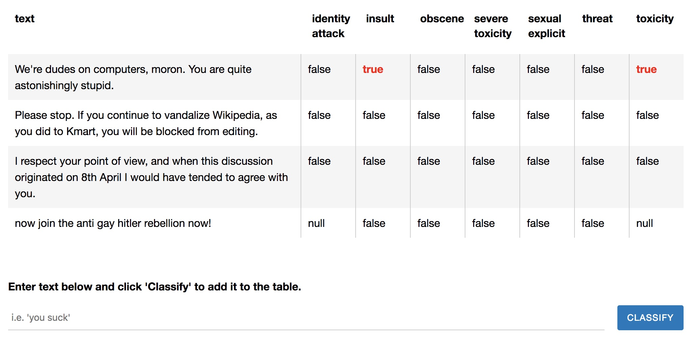

# Toxicity classifier

The toxicity model detects whether text contains toxic content such as threatening language, insults, obscenities, identity-based hate, or sexually explicit language. The model was trained on the civil comments dataset: [https://figshare.com/articles/data_json/7376747](https://figshare.com/articles/data_json/7376747) which contains ~2 million comments labeled for toxicity. The model is built on top of the Universal Sentence Encoder ([Cer et al., 2018](https://arxiv.org/pdf/1803.11175.pdf)).

More information about how the toxicity labels were calibrated can be found [here](https://github.com/conversationai/conversationai.github.io/blob/master/crowdsourcing_annotation_schemes/toxicity_with_subattributes.md).



Check out our [demo](https://storage.googleapis.com/tfjs-models/demos/toxicity/index.html), which uses the toxicity model to predict the toxicity of several sentences taken from this [Kaggle dataset](https://www.kaggle.com/c/jigsaw-toxic-comment-classification-challenge/data). Users can also input their own text for classification.

## Installation

Using `yarn`:

    $ yarn add @tensorflow/tfjs @tensorflow-models/toxicity

Using `npm`:

    $ npm install @tensorflow/tfjs @tensorflow-models/toxicity

## Usage

To import in npm:

```js
import * as toxicity from '@tensorflow-models/toxicity';
```

or as a standalone script tag:

```html
<script src="https://cdn.jsdelivr.net/npm/@tensorflow/tfjs"></script>
<script src="https://cdn.jsdelivr.net/npm/@tensorflow-models/toxicity"></script>
```

Then:

```js
// The minimum prediction confidence.
const threshold = 0.9;

// Load the model. Users optionally pass in a threshold and an array of
// labels to include.
toxicity.load(threshold).then(model => {
  const sentences = ['you suck'];

  model.classify(sentences).then(predictions => {
    // `predictions` is an array of objects, one for each prediction head,
    // that contains the raw probabilities for each input along with the
    // final prediction in `match` (either `true` or `false`).
    // If neither prediction exceeds the threshold, `match` is `null`.

    console.log(predictions);
    /*
    prints:
    {
      "label": "identity_attack",
      "results": [{
        "probabilities": [0.9659664034843445, 0.03403361141681671],
        "match": false
      }]
    },
    {
      "label": "insult",
      "results": [{
        "probabilities": [0.08124706149101257, 0.9187529683113098],
        "match": true
      }]
    },
    ...
     */
  });
});
```
