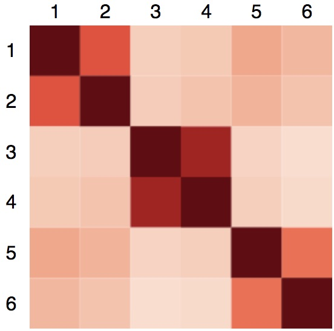

# Universal Sentence Encoder lite

The Universal Sentence Encoder ([Cer et al., 2018](https://arxiv.org/pdf/1803.11175.pdf)) (USE) is a model that encodes text into 512-dimensional embeddings. These embeddings can then be used as inputs to natural language processing tasks such as [sentiment classification](https://en.wikipedia.org/wiki/Sentiment_analysis) and [textual similarity](https://en.wikipedia.org/wiki/Semantic_similarity) analysis.

This module is a TensorFlow.js [`GraphModel`](https://js.tensorflow.org/api/latest/#loadGraphModel) converted from the USE lite ([module on TFHub](https://tfhub.dev/google/universal-sentence-encoder-lite/2)), a lightweight version of the original. The lite model is based on the Transformer ([Vaswani et al, 2017](https://arxiv.org/pdf/1706.03762.pdf)) architecture, and uses an 8k word piece [vocabulary](https://storage.googleapis.com/tfjs-models/savedmodel/universal_sentence_encoder/vocab.json).

In [this demo](./demo/index.js) we embed six sentences with the USE, and render their self-similarity scores in a matrix (redder means more similar):



*The matrix shows that USE embeddings can be used to cluster sentences by similarity.*

The sentences (taken from the [TensorFlow Hub USE lite colab](https://colab.sandbox.google.com/github/tensorflow/hub/blob/master/examples/colab/semantic_similarity_with_tf_hub_universal_encoder_lite.ipynb#scrollTo=_GSCW5QIBKVe)):
1. I like my phone.
2. Your cellphone looks great.
3. How old are you?
4. What is your age?
5. An apple a day, keeps the doctors away.
6. Eating strawberries is healthy.

## Installation

Using `yarn`:

    $ yarn add @tensorflow/tfjs@1.0.0 @tensorflow-models/universal-sentence-encoder

Using `npm`:

    $ npm install @tensorflow/tfjs@1.0.0 @tensorflow-models/universal-sentence-encoder

## Usage

To import in npm:

```js
import * as use from '@tensorflow-models/universal-sentence-encoder';
```

or as a standalone script tag:

```js
<script src="https://cdn.jsdelivr.net/npm/@tensorflow/tfjs@1.0.0"></script>
<script src="https://cdn.jsdelivr.net/npm/@tensorflow-models/universal-sentence-encoder"></script>
```

Then:

```js
// Load the model.
use.load().then(model => {
  // Embed an array of sentences.
  const sentences = [
    'Hello.',
    'How are you?'
  ];
  model.embed(sentences).then(embeddings => {
    // `embeddings` is a 2D tensor consisting of the 512-dimensional embeddings for each sentence.
    // So in this example `embeddings` has the shape [2, 512].
    embeddings.print(true /* verbose */);
  });
});
```

To use the Tokenizer separately:

```js
use.loadTokenizer().then(tokenizer => {
  tokenizer.encode('Hello, how are you?'); // [341, 4125, 8, 140, 31, 19, 54]
});
```
